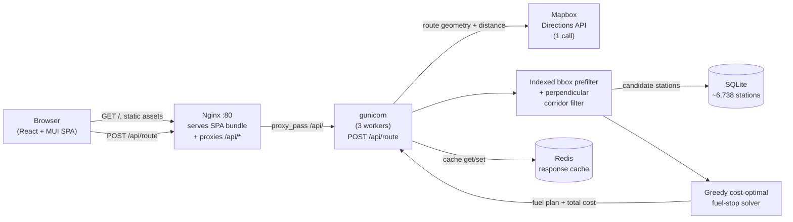
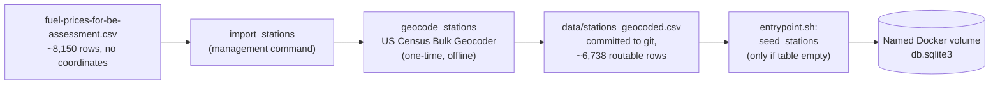

# Fuel Route Optimizer

A Django REST API that takes a start and finish location in the continental US and returns the driving route, the cheapest set of fuel stops along it, and the total fuel cost for the trip. It assumes a vehicle with a 500-mile range and 10 miles per gallon, and it picks stops from a fixed dataset of about 8,150 US truck-stop fuel prices to keep the total spend as low as possible. A React and Material UI single-page app draws the route and its stops on an interactive map, and the whole thing (API, cache, SPA) starts with one `docker compose up`.

> Built as a take-home assessment for a full-stack engineering role, and published here as a portfolio piece.

## Quickstart

```bash
git clone https://github.com/jadrianports/fuel-route-optimizer.git
cd fuel-route-optimizer
cp .env.example .env
```

Open `.env` and paste a [Mapbox](https://www.mapbox.com/) access token into the `MAPBOX_TOKEN=` line. The free tier is plenty (sign up, copy your default public token). That is the only value you need to set. Everything else already has a working default in `docker-compose.yml`.

```bash
docker compose up --build
```

Now open **http://localhost**. On first boot the `web` container runs migrations and seeds all ~6,738 geocoded stations, which takes a few seconds. `nginx` waits for `web` to report healthy before it starts serving, so you won't hit broken requests during startup. If port 80 is already taken on your machine, change the host side of `nginx.ports` in `docker-compose.yml` (say `"8080:80"`) and use that port instead.

Even without a Mapbox token the stack boots and the map page loads. A route request just returns a clear 502 `upstream_error` ("Map service unavailable") until you set one.

### Screenshots

A routed multi-stop trip (Dallas → Los Angeles), light and dark:

| Light | Dark |
|---|---|
|  |  |

Both show the same plan: the summary card with total cost, gallons, route miles, and stop count; the ordered itinerary listing each station's name, price per gallon, gallons, and cost; and the Leaflet map with the route polyline, numbered fuel-stop markers, and start/finish pins.

## Architecture

**Request path.** A browser hits Nginx on a single origin. Nginx serves the built SPA bundle and reverse-proxies `/api/*` to gunicorn, so there is no CORS to configure. The view makes at most one Mapbox Directions call, narrows the candidate stations with an indexed bounding-box query and an in-process geometric corridor test, runs a pure in-memory solver, and caches the full response in Redis (shared across all gunicorn workers) before returning it.



**Offline seed pipeline.** The station dataset ships without coordinates, so it gets geocoded once, offline, and the result is committed to the repo. No station geocoding ever happens at request time.



## Environment variables

`.env.example` documents every variable that `config/settings/base.py` reads. `docker compose up` already supplies the container-critical ones (`DJANGO_DEBUG`, `DJANGO_ALLOWED_HOSTS`, `CACHE_BACKEND`, `REDIS_URL`, `DB_NAME`) directly in `docker-compose.yml`, so `MAPBOX_TOKEN` really is the only line you need to fill in `.env` for the Docker demo. Everything below is for reference, or for running `manage.py` directly outside Docker.

| Variable | Default | Purpose |
|---|---|---|
| `MAPBOX_TOKEN` | *(none, required)* | Mapbox Directions and Geocoding access token. Get one free at mapbox.com. With no token, every route request 502s until it's set. |
| `DJANGO_SECRET_KEY` | dev fallback | Django's cryptographic signing key. |
| `DJANGO_DEBUG` | `True` locally / `False` in Docker | Debug mode. Docker Compose forces this off. |
| `DJANGO_ALLOWED_HOSTS` | `*` locally / `web,localhost,127.0.0.1,nginx` in Docker | Comma-separated allowed `Host:` headers. |
| `DB_ENGINE` / `DB_NAME` / `DB_HOST` / `DB_USER` / `DB_PASSWORD` / `DB_PORT` | SQLite at `db.sqlite3` | Only SQLite is used. Docker points `DB_NAME` at a named volume so the seeded database survives container restarts. |
| `CORRIDOR_ROOFTOP_MI` | `5` | Half-width of the "in-corridor" band for precisely-geocoded (rooftop) stations. |
| `CORRIDOR_CITY_MI` | `20` | Half-width of the band for city-level-geocoded stations. Looser geocoding precision needs a wider net. |
| `CACHE_BACKEND` | `locmem` | `locmem` for a single local process, `redis` in Docker (shared across workers). |
| `REDIS_URL` | `redis://localhost:6379/0` | Redis connection string, only read when `CACHE_BACKEND=redis`. |
| `CACHE_TTL_SECONDS` | `86400` | How long an identical `/api/route` response stays cached (1 day). |

On secrets: `.env` is gitignored and never committed, and `.env.example` (committed) carries only placeholders. The Mapbox token is a runtime-only environment variable on the `web` container. The SPA holds no token of its own, since map tiles come from OpenStreetMap through Leaflet rather than Mapbox.

## API reference

Every example below is real output from the live Docker stack. Mapbox tokens are redacted and the long `route_geometry` array is trimmed with `"..."`, but every other field is the exact response.

### `POST /api/route`

Body: `{"start": <location>, "finish": <location>}`. Each of `start` and `finish` accepts either a `"lat,lng"` string (latitude first) or a free-text US address. The same field takes both, and there is no separate "type" flag.

```bash
curl -s -X POST http://localhost/api/route \
  -H "Content-Type: application/json" \
  -d '{"start":"32.7767,-96.7970","finish":"34.0522,-118.2437"}'
```

```json
{
  "start": { "latitude": "32.7767", "longitude": "-96.7970" },
  "finish": { "latitude": "34.0522", "longitude": "-118.2437" },
  "route_geometry": [[-96.796754, 32.775944], [-96.845799, 32.764037], "..."],
  "total_route_mi": "1437",
  "fuel_stops": [
    { "name": "One9 #1248", "station_id": 63669, "location": { "latitude": "32.59742800", "longitude": "-96.68090500" }, "price_per_gallon": "2.76", "gallons": "0.07", "cost": "0.18" },
    { "name": "ROSCOE TRAVEL PLAZA", "station_id": 66689, "location": { "latitude": "32.44193400", "longitude": "-100.53223100" }, "price_per_gallon": "2.76", "gallons": "12.61", "cost": "34.80" },
    { "name": "DK", "station_id": 71079, "location": { "latitude": "31.84778000", "longitude": "-106.43110600" }, "price_per_gallon": "2.70", "gallons": "50.00", "cost": "134.95" },
    { "name": "DEMING TRUCK STOP", "station_id": 7230, "location": { "latitude": "32.26307600", "longitude": "-107.75249000" }, "price_per_gallon": "2.90", "gallons": "10.58", "cost": "30.66" },
    { "name": "TCI PHOENIX", "station_id": 71779, "location": { "latitude": "33.57215400", "longitude": "-112.09013200" }, "price_per_gallon": "2.92", "gallons": "20.47", "cost": "59.83" }
  ],
  "total_cost": "260.42",
  "total_gallons": "93.73",
  "map_url": "https://api.mapbox.com/styles/v1/mapbox/streets-v12/static/pin-s-a+3b82f6(-96.7970,32.7767),...,pin-s-b+22c55e(-118.2437,34.0522),path-3+ef4444-0.8(...)/auto/600x400?access_token=pk.***REDACTED***"
}
```

`station_id` is the real OPIS Truckstop ID from the source CSV, so every fuel stop is an actual row from `fuel-prices-for-be-assessment.csv` rather than a synthetic point. The response rounds `total_route_mi` to whole miles, and gallons and money to two decimals, only at this boundary. The solver and route math upstream stay at full precision. `map_url` opens a ready-to-view Mapbox Static Image of the route and its stops.

**Errors.** Every failure uses the same envelope, `{"error": {"code", "message", "detail"}}`:

| HTTP | `code` | When | Example |
|---|---|---|---|
| 400 | `invalid_input` | Missing/malformed `start`/`finish`, or a coordinate/geocoded address outside the continental US | `{"error":{"code":"invalid_input","message":"Invalid request.","detail":{"start":["This field is required."]}}}` |
| 422 | `route_not_found` | Mapbox found no drivable route (e.g. an island with no connecting road) | `{"error":{"code":"route_not_found","message":"Mapbox found no route: code='NoRoute'","detail":{}}}` |
| 422 | `infeasible_route` | The cheapest-cost plan still requires a leg longer than the 500-mile range | `{"error":{"code":"infeasible_route","message":"No feasible fuel plan: gap of 547 mi between 'START' and 'CHEVRON #383766' exceeds max range of 500 mi","detail":{"from_station":"START","to_station":"CHEVRON #383766","gap_mi":"547","max_range_mi":"500"}}}` |
| 502 | `upstream_error` | The Mapbox call itself failed (bad/missing token, network error, transient 5xx after retries are exhausted) | `{"error":{"code":"upstream_error","message":"Upstream routing provider failed."}}` |

The `infeasible_route` and `route_not_found` examples are both live, reproducible requests. See the demo walkthrough below.

### `GET /api/health`

A dependency-free liveness probe. It touches no database, cache, or Mapbox, and Docker Compose's healthcheck polls it before letting Nginx start serving traffic.

```bash
curl -s http://localhost/api/health
# {"status":"ok"}
```

### Trying it yourself

The `bruno/` directory is a native [Bruno](https://www.usebruno.com/) collection with all 9 `/api/route` scenarios (coordinate happy path, address happy path, mixed address/coordinate, cache-hit repeat, missing field, non-US location, route-not-found, infeasible-route, and multi-stop happy path) pointed at `http://localhost`. A `postman/` collection covers the same scenarios for Postman users.

## Assumptions

Four explicit assumptions are baked into the model:

1. **Full starting tank, at no cost.** The vehicle starts with a full tank (500 miles of range), and that first tank isn't charged against the trip's total cost.
2. **Corridor width.** A station only counts as "near the route" if it falls within `CORRIDOR_ROOFTOP_MI` (5 mi) of the route polyline for a precisely-geocoded (rooftop) address, or `CORRIDOR_CITY_MI` (20 mi) for a city-level-geocoded one.
3. **10 miles per gallon.** A fixed fuel efficiency, used to turn miles driven into gallons bought at each stop.
4. **500-mile maximum range.** No single leg may exceed 500 miles on a full tank, whether that leg is between two consecutive stops or between an endpoint and a stop.

## Design decisions

- **Just one Mapbox Directions call.** A single call (`geometries=geojson`, full route overview) returns both the geometry and the total distance, which is everything downstream needs. Address inputs add up to two Mapbox Geocoding calls, still inside the "2-3 acceptable" budget. The client-side `map_url` fetch never counts against that budget, because the server never makes it.
- **Offline US Census geocoding for the station dataset.** Mapbox's free geocoding tier doesn't allow permanently storing its results under the terms of service, so using it to backfill a persisted `lat`/`lng` column would be a violation. The US Census Bulk Geocoder has no such restriction and takes the whole dataset in one batch file, so the one-time `geocode_stations` backfill uses it and resolves about 6,738 of the CSV's rows to routable coordinates.
- **A greedy solver that's provably optimal for this problem.** At each point along the route the algorithm buys just enough fuel to reach the nearest strictly-cheaper reachable station, or fills the tank and jumps to the cheapest reachable station when nothing cheaper is in range. That rule is optimal here (buy cheap fuel as early as you can, and never pay more than you have to just to reach it), and it runs in a single pass with no backtracking. It optimizes for total cost rather than stop count or distance, so the number of stops tracks the price landscape along a corridor, not trip length alone. A 1,329-mile Dallas → DC route needs 10 stops while the longer 1,437-mile Dallas → LA route needs only 5, and both are correct outputs for their respective prices. Every leg still stays at or under 500 miles; total trip length is otherwise unbounded.
- **A bounding-box prefilter plus a corridor-distance test, no PostGIS.** One indexed `latitude`/`longitude` range query cuts ~6,738 stations down to a small candidate set. Then a shapely calculation measures each candidate's true perpendicular distance to the route polyline, projecting to a local equirectangular plane first (a degree of longitude isn't the same distance as a degree of latitude). That is more accurate than the cheap "distance from the endpoints" shortcut, which includes or drops stations wrongly depending on the route's shape, and it avoids pulling a PostGIS/GDAL system dependency in for a dataset this small.
- **Redis, because it actually matters here.** The Docker stack runs 3 gunicorn workers. Django's process-local `LocMemCache` would give each worker its own copy, so a repeat request could quietly miss depending on which worker handled it, which would make a cache-hit demo dishonest. Redis is shared across the workers, so a repeat is genuinely served from cache no matter who answers it. A cold request runs the full pipeline (~0.3-1s, mostly the Mapbox round trip); a cache hit comes back in about 10ms.
- **A pooled, retrying HTTP session for Mapbox.** The Mapbox client reuses a single `requests.Session`, so keep-alive avoids a fresh TLS handshake on every call, with bounded retries on connection resets and transient 5xx/429 responses. A stale keep-alive connection or a brief upstream blip then recovers on its own instead of surfacing a spurious 502.

## Testing

- **Backend:** `python manage.py test` runs the full Django/DRF suite. It covers the solver's edge cases (the exact 500-mile boundary, an infeasible gap, a single candidate station, a sub-500-mile trip that needs no stops, and the "greedy trap" where a farther but cheaper station has to win), the corridor filter's geometry, the Mapbox client and its error mapping, the cache-key normalizer, the full serializer and response contract, and the `/api/route` and `/api/health` views end to end.
- **Frontend:** `node --test src/api/routeClient.test.mjs` and `node --test src/utils/format.test.mjs` (run from `frontend/`) cover the per-error-code message mapper and the formatting helpers, with no extra test-runner dependency. On some Node/OS combinations `node --test src/api/` as a directory argument doesn't recurse, so pass the explicit file path instead.
- **API collections:** the `bruno/` (primary) and `postman/` collections exercise all nine request/response scenarios above against a running server, including the two error paths and a repeat-request cache-hit check.

## Demo walkthrough

A scripted path through the four presets built into the map page's sidebar. Each one fills both fields and submits automatically.

1. **Open the map page** at `http://localhost`. The map fills the main area with a continental-US default view, and the sidebar holds the location form and the preset chips.
2. **Denver → Kansas City** (happy path, single stop). Click the preset. The route polyline, one numbered fuel-stop marker, and the summary card (total cost, gallons, miles, stop count) all render together. Clicking the itinerary row pans to that marker and opens its popup.
3. **Dallas → Los Angeles** (happy path, multiple stops). A longer trip with 5 fuel stops across a different price landscape, showing that the same interaction scales to a full itinerary.
4. **Click the same preset again.** The response comes back almost instantly from the shared Redis cache instead of re-calling Mapbox and re-running the pipeline. You can watch the faster response time in the browser's network tab.
5. **San Francisco → Seattle** (422 `infeasible_route`). Shows the tailored error copy and the structured gap detail: which two stations, how big the gap is, and the max range.
6. **Catalina Island → Los Angeles** (422 `route_not_found`). An island with no connecting road, so Mapbox itself reports no drivable route.
7. **A quick code tour:** `routing/services/solver.py` (the greedy algorithm), `routing/services/corridor.py` (the bbox and perpendicular filter), `routing/views.py` (the orchestrator that ties it together), and `routing/cache.py` (the cache-key normalizer behind step 4).

## What I'd do next

- **Run the two address-geocoding calls concurrently.** When both `start` and `finish` are addresses, they're geocoded one after the other right now. Doing them at the same time would save roughly 150ms on address-only requests. I left it sequential to keep the request path a single, easy-to-follow synchronous chain within the assessment's timeline.
- **Pre-warm the preset routes into Redis at boot.** Right now the first click on any preset pays the full cold-request cost. Warming those routes into the cache during `entrypoint.sh` would make even the first demo click instant.
- **Look into thin West Coast station coverage.** A route like Seattle → San Diego is obviously drivable but currently reports `infeasible_route`, because the CSV has sparse station coverage along parts of the West Coast. Worth checking whether that's a real gap in the source data or a corridor-width tuning issue.
- Longer term (not attempted here): a Mapbox permanent-geocoding fallback for the handful of station addresses the Census geocoder can't resolve, alternative route options (fastest vs. cheapest), a per-request vehicle profile (range, mpg, tank size), and a live cloud deployment.

(The pooled, retrying Mapbox session mentioned earlier is already implemented, so it's not on this list.)

## License

© 2026 jadrianports. **All Rights Reserved.**

This repository is shared publicly for portfolio and evaluation purposes only. It is **not** open-source software. No license, express or implied, is granted to any person to use, copy, reproduce, modify, publish, redistribute, sublicense, or create derivative works from any part of this code, in whole or in part, without the author's prior written permission. See the [`LICENSE`](LICENSE) file for the full notice.
