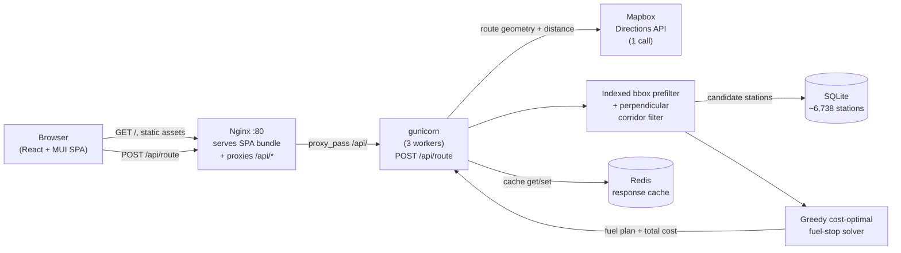
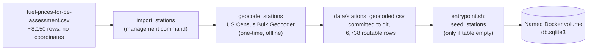

# Fuel Route Optimizer

A Django REST API that takes a start and finish location anywhere in the continental US and returns the driving route, the cost-optimal set of fuel stops along that route, and the total dollar cost of the trip. It models a vehicle with a 500-mile maximum range and 10 miles-per-gallon efficiency, and picks stops from a fixed dataset of ~8,150 US truck-stop fuel prices to minimize total fuel spend. A React + Material UI single-page app renders the route and stops on an interactive map, and the whole stack (API, cache, SPA) comes up with one `docker compose up`.

## Quickstart

```bash
git clone <this-repo>
cd spotter-assessment
cp .env.example .env
```

Open `.env` and paste a [Mapbox](https://www.mapbox.com/) access token (free tier is plenty — sign up, copy the default public token) into `MAPBOX_TOKEN=`. That is the only value you need to touch; every other setting has a working default baked into `docker-compose.yml`.

```bash
docker compose up --build
```

Then open **http://localhost** in a browser. The `web` container migrates the database and seeds all ~6,738 geocoded stations on first boot (a few seconds), and `nginx` won't start serving until `web` reports healthy, so there's no window of broken requests during startup. If port 80 is already taken on your machine, remap the host side in `docker-compose.yml`'s `nginx.ports` (e.g. `"8080:80"`) and use that port instead.

Without a Mapbox token the stack still boots and the map page still loads — a route request just returns a clear 502 `upstream_error` ("Map service unavailable") until a token is set.

### Screenshots

A routed multi-stop trip (Dallas → Los Angeles), light and dark:

| Light | Dark |
|---|---|
|  |  |

Both show the same plan — total cost, gallons, route miles, and stop count in the summary card; the full ordered itinerary (station name, price/gallon, gallons, cost per stop); and the Leaflet map with the route polyline plus numbered fuel-stop markers and start/finish pins.

## Architecture

**Request path** — a browser hits Nginx on a single origin; Nginx serves the built SPA bundle and reverse-proxies `/api/*` to gunicorn, so there is no CORS to configure. The view does at most one Mapbox Directions call, filters candidate stations with an indexed bounding-box query plus an in-process geometric corridor test, runs a pure in-memory solver, and caches the full response in Redis (shared across all gunicorn workers) before returning it.



**Offline seed pipeline** — the station dataset has no coordinates, so it is geocoded once, offline, and the result is committed to the repo. No station-geocoding call ever happens at request time.



## Environment variables

`.env.example` documents every variable `config/settings/base.py` reads. `docker compose up` already supplies the container-critical ones (`DJANGO_DEBUG`, `DJANGO_ALLOWED_HOSTS`, `CACHE_BACKEND`, `REDIS_URL`, `DB_NAME`) directly in `docker-compose.yml`, so `MAPBOX_TOKEN` really is the only line you need to fill in `.env` for the Docker demo. Everything else below is for reference or for running `manage.py` directly outside Docker.

| Variable | Default | Purpose |
|---|---|---|
| `MAPBOX_TOKEN` | *(none — required)* | Mapbox Directions + Geocoding access token. Get one free at mapbox.com; no token means every route request 502s until it's set. |
| `DJANGO_SECRET_KEY` | dev fallback | Django's cryptographic signing key. |
| `DJANGO_DEBUG` | `True` locally / `False` in Docker | Debug mode; Docker Compose forces this off. |
| `DJANGO_ALLOWED_HOSTS` | `*` locally / `web,localhost,127.0.0.1,nginx` in Docker | Comma-separated allowed `Host:` headers. |
| `DB_ENGINE` / `DB_NAME` / `DB_HOST` / `DB_USER` / `DB_PASSWORD` / `DB_PORT` | SQLite at `db.sqlite3` | Only SQLite is used; Docker points `DB_NAME` at a named volume so the seeded database survives container restarts. |
| `CORRIDOR_ROOFTOP_MI` | `5` | Half-width of the "in-corridor" band for precisely-geocoded (rooftop) stations. |
| `CORRIDOR_CITY_MI` | `20` | Half-width of the band for city-level-geocoded stations (looser precision needs a wider net). |
| `CACHE_BACKEND` | `locmem` | `locmem` for a single local process, `redis` in Docker (shared across workers). |
| `REDIS_URL` | `redis://localhost:6379/0` | Redis connection string, only read when `CACHE_BACKEND=redis`. |
| `CACHE_TTL_SECONDS` | `86400` | How long an identical `/api/route` response is cached (1 day). |

Secrets hygiene: `.env` is gitignored and never committed; `.env.example` (committed) carries only placeholders. The Mapbox token is a runtime-only environment variable on the `web` container — the SPA itself holds no token, since map tiles come from OpenStreetMap via Leaflet, not Mapbox.

## API reference

All examples below are real output from the live Docker stack (Mapbox access tokens redacted; the huge `route_geometry` array is trimmed with `"..."`, but every other field is the exact, unmodified response).

### `POST /api/route`

Body: `{"start": <location>, "finish": <location>}`. Each of `start`/`finish` is polymorphic — either a `"lat,lng"` string (note: **latitude first**) or a free-text US address string. Both go through the same field; there is no separate "type" flag.

```bash
curl -s -X POST http://localhost/api/route \
  -H "Content-Type: application/json" \
  -d '{"start":"32.7767,-96.7970","finish":"34.0522,-118.2437"}'
```

```json
{
  "start": { "latitude": "32.7767", "longitude": "-96.7970" },
  "finish": { "latitude": "34.0522", "longitude": "-118.2437" },
  "route_geometry": [[-96.796754, 32.775944], [-96.845799, 32.764037], "..."],
  "total_route_mi": "1437",
  "fuel_stops": [
    { "name": "One9 #1248", "station_id": 63669, "location": { "latitude": "32.59742800", "longitude": "-96.68090500" }, "price_per_gallon": "2.76", "gallons": "0.07", "cost": "0.18" },
    { "name": "ROSCOE TRAVEL PLAZA", "station_id": 66689, "location": { "latitude": "32.44193400", "longitude": "-100.53223100" }, "price_per_gallon": "2.76", "gallons": "12.61", "cost": "34.80" },
    { "name": "DK", "station_id": 71079, "location": { "latitude": "31.84778000", "longitude": "-106.43110600" }, "price_per_gallon": "2.70", "gallons": "50.00", "cost": "134.95" },
    { "name": "DEMING TRUCK STOP", "station_id": 7230, "location": { "latitude": "32.26307600", "longitude": "-107.75249000" }, "price_per_gallon": "2.90", "gallons": "10.58", "cost": "30.66" },
    { "name": "TCI PHOENIX", "station_id": 71779, "location": { "latitude": "33.57215400", "longitude": "-112.09013200" }, "price_per_gallon": "2.92", "gallons": "20.47", "cost": "59.83" }
  ],
  "total_cost": "260.42",
  "total_gallons": "93.73",
  "map_url": "https://api.mapbox.com/styles/v1/mapbox/streets-v12/static/pin-s-a+3b82f6(-96.7970,32.7767),...,pin-s-b+22c55e(-118.2437,34.0522),path-3+ef4444-0.8(...)/auto/600x400?access_token=pk.***REDACTED***"
}
```

`station_id` is the real OPIS Truckstop ID from the source CSV — every fuel stop is a genuine row from `fuel-prices-for-be-assessment.csv`, not a synthetic point. `total_route_mi`, gallons, and money are all quantized to whole miles / 2 decimal places only at this response boundary; the solver and route math upstream stay full precision. `map_url` opens a ready-to-view Mapbox Static Image of the exact route and stops.

**Errors** — every failure uses the same envelope, `{"error": {"code", "message", "detail"}}`:

| HTTP | `code` | When | Example |
|---|---|---|---|
| 400 | `invalid_input` | Missing/malformed `start`/`finish`, or a coordinate/geocoded address outside the continental US | `{"error":{"code":"invalid_input","message":"Invalid request.","detail":{"start":["This field is required."]}}}` |
| 422 | `route_not_found` | Mapbox found no drivable route (e.g. an island with no connecting road) | `{"error":{"code":"route_not_found","message":"Mapbox found no route: code='NoRoute'","detail":{}}}` |
| 422 | `infeasible_route` | The cheapest-cost plan still requires a leg longer than the 500-mile range | `{"error":{"code":"infeasible_route","message":"No feasible fuel plan: gap of 547 mi between 'START' and 'CHEVRON #383766' exceeds max range of 500 mi","detail":{"from_station":"START","to_station":"CHEVRON #383766","gap_mi":"547","max_range_mi":"500"}}}` |
| 502 | `upstream_error` | The Mapbox call itself failed (bad/missing token, network error, transient 5xx after retries are exhausted) | `{"error":{"code":"upstream_error","message":"Upstream routing provider failed."}}` |

The `infeasible_route` example above and the `route_not_found` example are both live, reproducible requests — see the Demo walkthrough section.

### `GET /api/health`

A dependency-free liveness probe (touches no database, cache, or Mapbox) that Docker Compose's healthcheck polls before letting Nginx start serving traffic:

```bash
curl -s http://localhost/api/health
# {"status":"ok"}
```

### Trying it yourself

The `bruno/` directory is a native [Bruno](https://www.usebruno.com/) collection with all 9 `/api/route` scenarios (coordinate happy path, address happy path, mixed address/coordinate, cache-hit repeat, missing field, non-US location, route-not-found, infeasible-route, multi-stop happy path) pointed at `http://localhost`. A `postman/` collection covers the same scenarios for Postman users.

## Assumptions

The four explicit assumptions baked into the model:

1. **Full starting tank, at no cost.** The vehicle begins the trip with a full 500-mile-range tank; that first tank of fuel isn't charged against the trip's total cost.
2. **Corridor width.** A station only counts as "near the route" if it's within `CORRIDOR_ROOFTOP_MI` (5 mi) of the route polyline for a precisely-geocoded (rooftop) address, or `CORRIDOR_CITY_MI` (20 mi) for a city-level-geocoded one.
3. **10 miles per gallon.** Fixed fuel efficiency used to convert miles driven into gallons purchased at every stop.
4. **500-mile maximum range.** No leg between two consecutive stops — or between start/finish and a stop — may exceed 500 miles on a full tank.

## Design decisions

- **One Mapbox Directions call, not many.** A single call (`geometries=geojson`, full route overview) returns both the geometry and total distance needed for everything downstream. Address inputs add up to two Mapbox Geocoding calls (still within the "2–3 acceptable" budget); the client-side `map_url` fetch never counts against this budget since our server never makes it.
- **Offline US Census geocoding, not live Mapbox geocoding, for the ~8,150-station dataset.** Mapbox's free/temporary geocoding tier's results may not be permanently stored under its terms of service — using it to backfill a persisted `lat`/`lng` column would violate that. The US Census Bulk Geocoder has no such restriction and accepts the whole dataset in one batch file, so the one-time offline backfill (`geocode_stations`) uses it instead, resolving ~6,738 of the CSV's rows to routable coordinates.
- **A provably-optimal greedy solver, not a heuristic.** At each point along the route, the algorithm buys just enough fuel to reach the nearest strictly-cheaper reachable station, or fills the tank and jumps to the cheapest reachable station if no cheaper option exists within range. This greedy rule is optimal for this problem shape (buy cheap fuel as early as possible, never pay more than necessary to reach it) and runs in a single pass with no backtracking. The solver optimizes for **total cost**, not number of stops or shortest distance — so stop count varies with the price landscape along a given corridor, not trip length alone (e.g. a 1,329-mile Dallas→DC route needs 10 stops while a longer 1,437-mile Dallas→LA route needs only 5 — both are correct, cost-optimal outputs for their respective price landscapes). Every leg is still bounded at ≤500 mi; total trip length is otherwise unbounded.
- **Indexed bounding-box prefilter + perpendicular corridor-distance test, not PostGIS.** A single indexed `latitude`/`longitude` range query narrows ~6,738 stations down to a small candidate set, then an in-process shapely calculation measures each candidate's true perpendicular distance to the route polyline (via a local equirectangular projection, since raw lat/lng degrees aren't equal-distance) — not the crude "distance from the endpoints" shortcut, which would miss or wrongly include stations depending on the route's shape. This avoids any PostGIS/GDAL system dependency for a dataset this size.
- **Redis when it counts.** The Docker stack runs 3 gunicorn workers, and Django's process-local `LocMemCache` would give each worker its own cache — a repeat identical request could silently miss depending on which worker handled it, making a "cache hit" demo dishonest. Redis is shared across all 3 workers, so a repeat request is genuinely served from cache regardless of which worker answers it: a cold request runs the full pipeline (~0.3–1s, dominated by the Mapbox round trip), a cache hit returns in ~10ms.
- **A pooled, retrying HTTP session for Mapbox calls.** The Mapbox client reuses one `requests.Session` (HTTP keep-alive avoids a fresh TLS handshake per call) with bounded retries on connection resets and transient 5xx/429 responses — recovering transparently from a stale keep-alive connection or a brief upstream blip without surfacing a spurious 502.

## Testing

- **Backend:** `python manage.py test` runs the full Django/DRF suite — the pure solver's edge cases (exact 500-mile boundary, an infeasible gap, a single candidate station, a sub-500-mile trip needing no stops, and the "greedy trap" case where a farther-but-cheaper station must be preferred), the corridor filter's geometry, the Mapbox client and its error mapping, the cache key normalizer, the full serializer/response contract, and the `/api/route` and `/api/health` views end to end.
- **Frontend:** `node --test src/api/routeClient.test.mjs` and `node --test src/utils/format.test.mjs` (run from `frontend/`) cover the per-error-code message mapper and formatting helpers with no extra test-runner dependency. (On some Node/OS combinations `node --test src/api/` as a directory argument doesn't recurse — pass the explicit file path instead.)
- **API collections:** the `bruno/` (primary) and `postman/` collections exercise all nine real request/response scenarios above against a running server, including the two error paths and a repeat-request cache-hit check.

## Demo walkthrough

A scripted path through the same four presets built into the map page's sidebar (each fills both fields and submits automatically):

1. **Open the map page** at `http://localhost`. The map fills the main area with a continental-US default view; the sidebar holds the location form and preset chips.
2. **Denver → Kansas City** (happy path, single stop) — click the preset. The route polyline, one numbered fuel-stop marker, and the summary card (total cost, gallons, miles, stop count) render together; clicking the itinerary row pans/opens that marker's popup.
3. **Dallas → Los Angeles** (happy path, multiple stops) — a longer trip with 5 fuel stops across a different price landscape, showing the same interaction pattern scales to a full itinerary.
4. **Click the same preset again** — the response returns near-instantly from the shared Redis cache instead of re-calling Mapbox and re-running the pipeline (visible in the browser's network tab as a much faster response time).
5. **San Francisco → Seattle** (422 `infeasible_route`) — demonstrates the tailored error copy and the structured gap detail (which two stations, how large the gap, what the max range is).
6. **Catalina Island → Los Angeles** (422 `route_not_found`) — an island with no connecting road demonstrates Mapbox itself reporting no drivable route.
7. **Brief code tour** — `routing/services/solver.py` (the greedy algorithm), `routing/services/corridor.py` (the bbox + perpendicular filter), `routing/views.py` (the orchestrator tying it together), and `routing/cache.py` (the cache-key normalizer backing step 4).

## What I'd do next

- **Run the two address-geocoding calls concurrently.** When both `start` and `finish` are addresses, they're currently geocoded sequentially — running them concurrently would save roughly 150ms on address-only requests. Deferred to keep the request path a single synchronous, easy-to-follow call chain within the assessment's timeline.
- **Pre-warm the four preset routes into Redis at container boot.** Right now the very first click on any preset pays the full cold-request cost; warming the cache during `entrypoint.sh` would make even that first demo click instant.
- **Investigate thin West Coast station coverage in the dataset.** A route like Seattle → San Diego — an obviously drivable corridor — currently reports `infeasible_route`, because the underlying CSV simply has sparse station coverage along parts of the West Coast. Worth digging into whether that's a real gap in the source data or a corridor-width tuning issue.
- Longer-term (not attempted here): a Mapbox permanent-geocoding fallback for the handful of station addresses the Census geocoder can't resolve, alternative (fastest-vs-cheapest) route options, a per-request configurable vehicle profile (range/mpg/tank size), and a live cloud deployment.

(The pooled, retrying Mapbox HTTP session mentioned above is already implemented — not on this list.)

## License

© 2026 jadrianports. **All Rights Reserved.**

This repository is shared publicly for portfolio and evaluation purposes only. It is **not** open-source software. No license — express or implied — is granted to any person to use, copy, reproduce, modify, publish, redistribute, sublicense, or create derivative works from any part of this code, in whole or in part, without the author's prior written permission. See the [`LICENSE`](LICENSE) file for the full notice.
