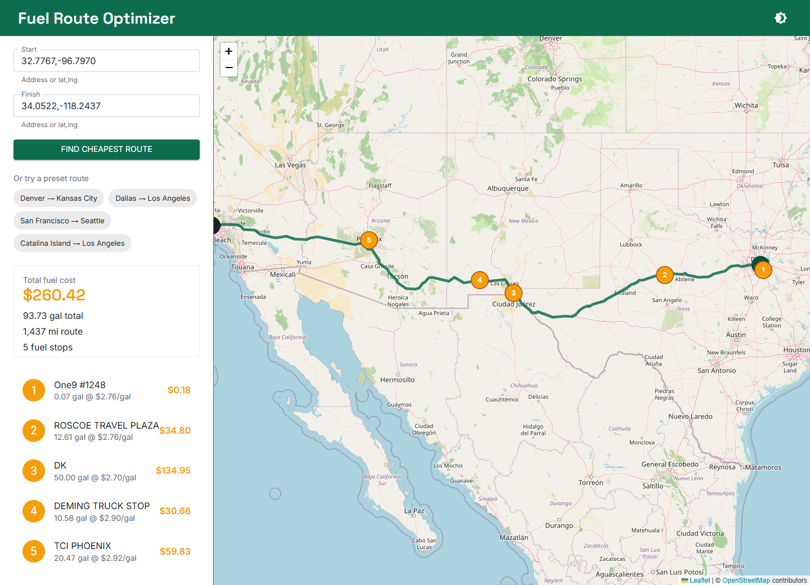
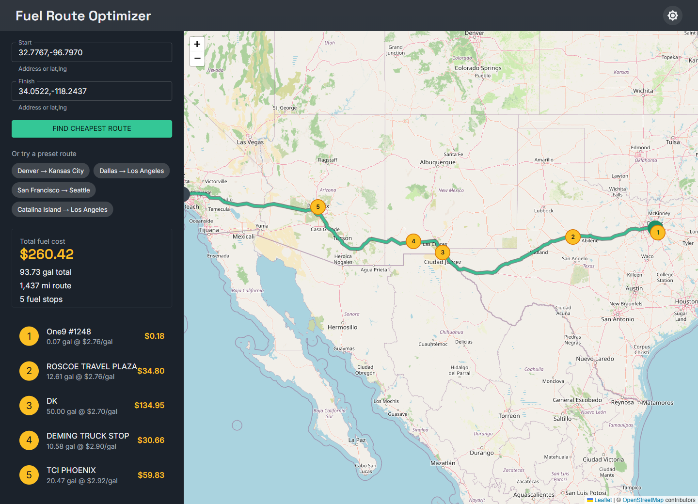
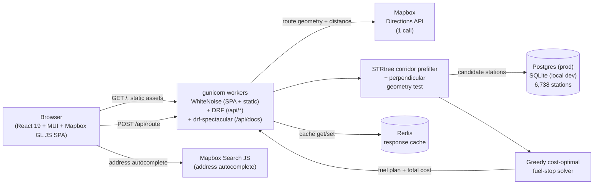
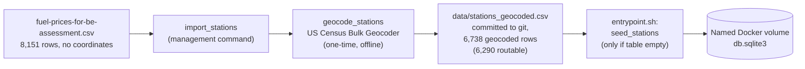

# TankWise

[](https://github.com/jadrianports/tankwise/actions/workflows/ci.yml)
[](https://codecov.io/gh/jadrianports/tankwise)
[](LICENSE)
[](#free-tier-deployment)
[](https://www.python.org/)
[](https://www.djangoproject.com/)
[](https://nodejs.org/)
[](https://react.dev/)

TankWise is a route and cost-optimal fuel-stop planner built for truckers and small-fleet dispatchers: give it a start and finish location anywhere in the continental US and it returns the driving route, the cheapest feasible sequence of fuel stops along it, and the total fuel cost for the trip — chosen from 6,290 routable truck-stop stations (8,151 raw price rows, 6,738 successfully geocoded). A React, MUI, and Mapbox GL JS single-page app renders the route, the stops, and the savings story on an interactive map, and the whole stack (API, cache, SPA) starts with one `docker compose up`.

> It began as a take-home assessment for a full-stack engineering role and has since been grown into a rebranded, launch-ready portfolio product.

The `POST /api/route` contract itself is unchanged from the assessment: the API's default vehicle is still 10 mpg with a 500-mile range. The map UI, however, defaults to the "Semi-loaded" vehicle preset, so a screenshot or demo click-through shows different numbers than a bare `curl` against the API's own default — both are correct, they're just two different starting points over the same solver.

## Quickstart

```bash
git clone https://github.com/jadrianports/tankwise.git
cd tankwise
cp .env.example .env
```

Open `.env` and set two [Mapbox](https://www.mapbox.com/) tokens: a secret token on the `MAPBOX_TOKEN=` line, and a public (`pk.*`) token on the `MAPBOX_PUBLIC_TOKEN=` line. See "Mapbox tokens" below for how to create the public one and a gotcha to avoid.

```bash
docker compose up --build
```

Now open **http://localhost**. On first boot the `web` container runs migrations and seeds all 6,738 geocoded stations (6,290 of them routable), which takes a few seconds; `web` itself waits for `redis` to report healthy before it starts, so you won't hit a broken cache the moment it comes up. If port 80 is already taken on your machine, change the host side of `web.ports` in `docker-compose.yml` (say `"8080:80"`) and use that port instead.

Even without Mapbox tokens the stack boots and the map page loads. A route request just returns a clear 502 `upstream_error` until both `MAPBOX_TOKEN` and `MAPBOX_PUBLIC_TOKEN` are set.

### Mapbox tokens

The app uses two separate Mapbox tokens, on purpose:

- **`MAPBOX_TOKEN`** (secret, `sk.*` or a default `pk.*`) stays server-side and drives the Directions and Geocoding calls. It never reaches the browser.
- **`MAPBOX_PUBLIC_TOKEN`** is a public token, created from the Mapbox dashboard's **Access tokens** page, that must start with `pk.`. It's embedded in the `map_url` returned to and opened by the browser (address bar, Bruno, curl).

The gotcha: opening `map_url` directly sends no `Referer` header, since it's a direct navigation rather than an embedded page fetch. A URL-restricted public token rejects requests with no matching `Referer`, so a restricted token turns every `map_url` open into a 403. For local dev and this assessment's demo, create the public token **without** URL restrictions. Reserve URL-restricted public tokens for a real production deploy where `map_url` is fetched from a page served on a known origin.

### Screenshots

A routed multi-stop trip (Dallas → Los Angeles), light and dark:

| Light | Dark |
|---|---|
|  |  |

Both show the same plan: the summary card with total cost, gallons, route miles, and stop count; the ordered itinerary listing each station's name, price per gallon, gallons, and cost; and the Leaflet map with the route polyline, numbered fuel-stop markers, and start/finish pins.

## Architecture

**Request path.** A browser hits a single gunicorn process on one origin. WhiteNoise, running inside that same process, serves the built SPA bundle and Django/DRF's own static assets ahead of the URL resolver; a client-side deep link that isn't a real file falls through to a catch-all view that returns the same SPA shell. Everything else is namespaced under `/api/`, so there is still no CORS to configure -- it's still one origin, just without a separate proxy in front of it. The route view makes at most one Mapbox Directions call, narrows the candidate stations with an indexed bounding-box query and an in-process geometric corridor test, runs a pure in-memory solver, and caches the full response in Redis (shared across all gunicorn workers) before returning it.



**Offline seed pipeline.** The station dataset ships without coordinates, so it gets geocoded once, offline, and the result is committed to the repo. No station geocoding ever happens at request time.



## Environment variables

`.env.example` documents every variable that `config/settings/base.py` reads. `docker compose up` already supplies the container-critical ones (`DJANGO_DEBUG`, `DJANGO_ALLOWED_HOSTS`, `CACHE_BACKEND`, `REDIS_URL`, `DB_NAME`) directly in `docker-compose.yml`, so the two Mapbox tokens below are the lines you need to fill in `.env` for the Docker demo: the secret `MAPBOX_TOKEN` for Directions/Geocoding, and the public `MAPBOX_PUBLIC_TOKEN` for `map_url`. Both flow into the container through the existing `.env` file passthrough, with no `docker-compose.yml` changes needed. Everything below is for reference, or for running `manage.py` directly outside Docker.

| Variable | Default | Purpose |
|---|---|---|
| `MAPBOX_TOKEN` | *(none, required)* | Secret Mapbox Directions and Geocoding access token, used server-side only. Get one free at mapbox.com. With no token, every route request 502s until it's set. |
| `MAPBOX_PUBLIC_TOKEN` | *(none, required)* | Public (`pk.*`) Mapbox token used only to build the browser-facing `map_url`. Must start with `pk.`; a missing or non-`pk.` value makes every route request 502. See "Mapbox tokens" below. |
| `DJANGO_SECRET_KEY` | dev fallback | Django's cryptographic signing key. |
| `DJANGO_DEBUG` | `True` locally / `False` in Docker | Debug mode. Docker Compose forces this off. |
| `DJANGO_ALLOWED_HOSTS` | `*` locally / `web,localhost,127.0.0.1` in Docker | Comma-separated allowed `Host:` headers. |
| `DB_ENGINE` / `DB_NAME` / `DB_HOST` / `DB_USER` / `DB_PASSWORD` / `DB_PORT` | SQLite at `db.sqlite3` | Only SQLite is used. Docker points `DB_NAME` at a named volume so the seeded database survives container restarts. |
| `CORRIDOR_ROOFTOP_MI` | `5` | Half-width of the "in-corridor" band for precisely-geocoded (rooftop) stations. |
| `CORRIDOR_CITY_MI` | `20` | Half-width of the band for city-level-geocoded stations. Looser geocoding precision needs a wider net. |
| `CACHE_BACKEND` | `locmem` | `locmem` for a single local process, `redis` in Docker (shared across workers). |
| `REDIS_URL` | `redis://localhost:6379/0` | Redis connection string, only read when `CACHE_BACKEND=redis`. |
| `CACHE_TTL_SECONDS` | `86400` | How long an identical `/api/route` response stays cached (1 day). |
| `DB_SSLMODE` | `require` | TLS mode for the Postgres connection. Neon requires TLS; ignored for local SQLite. |
| `DB_CONN_MAX_AGE` | `0` | Persistent-connection lifetime in seconds. `0` closes the connection after each request, which is correct when a pooler (Neon's PgBouncer) already pools connections in front of Django. |
| `DB_CONN_HEALTH_CHECKS` | `True` | Verifies a reused persistent connection is still alive before use. |
| `DB_MIGRATE_HOST` | *(unset)* | Neon's direct, non-pooled endpoint. `entrypoint.sh` runs `manage.py migrate` against this host instead of `DB_HOST` when it's set, because transaction-mode connection pooling is documented as error-prone for schema migrations. |
| `DJANGO_SETTINGS_MODULE` | `config.settings` locally | Set to `config.settings.production` on the deployed service to select the hardened profile: `DEBUG=False`, HTTPS enforcement, secure cookies, explicit `ALLOWED_HOSTS`. |
| `SECURE_HSTS_SECONDS` | `31536000` (1 year) | HSTS duration under `config.settings.production`. No effect locally. |
| `NUM_PROXIES` | `1` | Trusted reverse-proxy hop count DRF excludes from `X-Forwarded-For` when identifying the real client IP for rate limiting. `1` matches a single edge proxy in front of the service. |
| `ROUTE_THROTTLE_BURST_RATE` | `20/min` | Burst rate limit on `POST /api/route` only; every other endpoint stays unthrottled. |
| `ROUTE_THROTTLE_SUSTAINED_RATE` | `200/day` | Sustained daily rate limit on `POST /api/route` only. |
| `WEB_CONCURRENCY` | `2` | gunicorn worker process count. Measurement-backed against a 512 MB memory limit — see "Free-tier deployment" below. |
| `GUNICORN_TIMEOUT` | `30` | Per-request timeout in seconds. |
| `GUNICORN_MAX_REQUESTS` / `GUNICORN_MAX_REQUESTS_JITTER` | `500` / `50` | Requests a worker handles before it's recycled, plus random jitter, guarding against slow memory creep over a long-running process. |
| `FUEL_PRICE_AS_OF` | `2025-01-01` | Display-only metadata qualifying every price/cost figure the API returns. See "Free-tier deployment" below for how this date was derived. |
| `FUEL_PRICE_DATA_NOTE` | see `config/settings/base.py` | The full data-vintage caveat shipped in the JSON payload itself. |

On secrets: `.env` is gitignored and never committed, and `.env.example` (committed) carries only placeholders. The Mapbox token is a runtime-only environment variable on the `web` container. The SPA holds no token of its own, since map tiles come from OpenStreetMap through Leaflet rather than Mapbox. The `render.yaml` Blueprint that declares the live deployment's service follows the same rule at the infrastructure level: every credential (the Django secret key, the Postgres and Redis connection details, both Mapbox tokens) is declared in the Blueprint's non-synced form, so the hosting dashboard prompts for it rather than it ever being written into a committed file — `render.yaml` itself carries only non-secret configuration (throttle rates, gunicorn tuning, the settings module path, and so on).

## Free-tier deployment

The live deployment (when published) runs on Render's free web-service tier, backed by Neon (Postgres) and Upstash (Redis) -- three independent $0 services, not a production SLA. Three things worth knowing before judging response times or data freshness:

1. **Cold starts.** Render spins the free-tier instance down after about 15 minutes with no inbound traffic. The first request after that idle window wakes it back up, which can take roughly a minute; every request after that is fast again. An external cron pings `GET /api/health` every ~10 minutes to keep the instance warm during normal use, so this mostly only shows up after a long gap between visits, not mid-demo.
2. **Data vintage.** Fuel prices are a static truck-stop snapshot with no per-row timestamp -- not live quotes. Cross-referencing the dataset's own price statistics (mean ~$3.50/gal, a California high near $6.40) against EIA's published on-highway diesel averages dates it to roughly late 2024/early 2025 (`FUEL_PRICE_AS_OF`, `2025-01-01`). Every price and cost figure the API returns reflects that one snapshot, not today's pump prices.
3. **Free-tier scope.** This is a single instance running a small worker count (`WEB_CONCURRENCY=2`), a free-tier database and cache, no horizontal scaling, and no uptime guarantee -- a demo deployment, not a production one.

### Readiness and liveness

Two probes exist because they answer two different questions. `GET /api/health` touches no dependency at all -- it's what the keep-warm cron and Docker Compose's own healthcheck poll, so neither one puts load on the database or cache on a schedule. `GET /api/ready` actually checks the database, cache, and Mapbox token configuration, and is what the hosting platform gates traffic routing on: an instance reporting `not_ready` never receives real requests. See both response shapes in the API reference below.

## API reference

Every example below is real output from the live Docker stack. Mapbox tokens are redacted and the long `route_geometry` array is trimmed with `"..."`, but every other field is the exact response.

### `POST /api/route`

Body: `{"start": <location>, "finish": <location>}`. Each of `start` and `finish` accepts either a `"lat,lng"` string (latitude first) or a free-text US address. The same field takes both, and there is no separate "type" flag.

```bash
curl -s -X POST http://localhost/api/route \
  -H "Content-Type: application/json" \
  -d '{"start":"32.7767,-96.7970","finish":"34.0522,-118.2437"}'
```

```json
{
  "start": { "latitude": "32.7767", "longitude": "-96.7970" },
  "finish": { "latitude": "34.0522", "longitude": "-118.2437" },
  "route_geometry": [[-96.796754, 32.775944], [-96.845799, 32.764037], "..."],
  "total_route_mi": "1437",
  "fuel_stops": [
    { "name": "One9 #1248", "station_id": 63669, "location": { "latitude": "32.59742800", "longitude": "-96.68090500" }, "price_per_gallon": "2.76", "gallons": "0.07", "cost": "0.18" },
    { "name": "ROSCOE TRAVEL PLAZA", "station_id": 66689, "location": { "latitude": "32.44193400", "longitude": "-100.53223100" }, "price_per_gallon": "2.76", "gallons": "12.61", "cost": "34.80" },
    { "name": "DK", "station_id": 71079, "location": { "latitude": "31.84778000", "longitude": "-106.43110600" }, "price_per_gallon": "2.70", "gallons": "50.00", "cost": "134.95" },
    { "name": "DEMING TRUCK STOP", "station_id": 7230, "location": { "latitude": "32.26307600", "longitude": "-107.75249000" }, "price_per_gallon": "2.90", "gallons": "10.58", "cost": "30.66" },
    { "name": "TCI PHOENIX", "station_id": 71779, "location": { "latitude": "33.57215400", "longitude": "-112.09013200" }, "price_per_gallon": "2.92", "gallons": "20.47", "cost": "59.83" }
  ],
  "total_cost": "260.42",
  "total_gallons": "93.73",
  "map_url": "https://api.mapbox.com/styles/v1/mapbox/streets-v12/static/pin-s-a+3b82f6(-96.7970,32.7767),...,pin-s-b+22c55e(-118.2437,34.0522),path-3+ef4444-0.8(...)/auto/600x400?access_token=pk.***REDACTED***"
}
```

`station_id` is the real OPIS Truckstop ID from the source CSV, so every fuel stop is an actual row from `fuel-prices-for-be-assessment.csv` rather than a synthetic point. The response rounds `total_route_mi` to whole miles, and gallons and money to two decimals, only at this boundary. The solver and route math upstream stay at full precision. `map_url` opens a ready-to-view Mapbox Static Image of the route and its stops.

**Errors.** Every failure uses the same envelope, `{"error": {"code", "message", "detail"}}`:

| HTTP | `code` | When | Example |
|---|---|---|---|
| 400 | `invalid_input` | Missing/malformed `start`/`finish`, or a coordinate/geocoded address outside the continental US | `{"error":{"code":"invalid_input","message":"Invalid request.","detail":{"start":["This field is required."]}}}` |
| 422 | `route_not_found` | Mapbox found no drivable route (e.g. an island with no connecting road) | `{"error":{"code":"route_not_found","message":"Mapbox found no route: code='NoRoute'","detail":{}}}` |
| 422 | `infeasible_route` | The cheapest-cost plan still requires a leg longer than the 500-mile range | `{"error":{"code":"infeasible_route","message":"No feasible fuel plan: gap of 547 mi between 'START' and 'CHEVRON #383766' exceeds max range of 500 mi","detail":{"from_station":"START","to_station":"CHEVRON #383766","gap_mi":"547","max_range_mi":"500"}}}` |
| 502 | `upstream_error` | The Mapbox call itself failed (bad/missing token, network error, transient 5xx after retries are exhausted) | `{"error":{"code":"upstream_error","message":"Upstream routing provider failed."}}` |
| 429 | `rate_limited` | `POST /api/route` exceeded its burst (`ROUTE_THROTTLE_BURST_RATE`, default 20/min) or sustained (`ROUTE_THROTTLE_SUSTAINED_RATE`, default 200/day) rate limit. No other endpoint is throttled. | `{"error":{"code":"rate_limited","message":"Too many requests.","detail":{"retry_after_s":42}}}` |

The `infeasible_route` and `route_not_found` examples are both live, reproducible requests. See the demo walkthrough below. A 429 also carries a `Retry-After` header (seconds until the next allowed request, set by DRF itself); `retry_after_s` in the body mirrors the same value.

### `GET /api/health`

A dependency-free liveness probe. It touches no database, cache, or Mapbox, so it stays fast and always answers even on a freshly-booted, unseeded instance. Docker Compose's own healthcheck polls it to report the `web` container's health status, and on a live deploy it's what an external keep-warm cron hits to prevent the free-tier instance from spinning down (see "Free-tier deployment" above).

```bash
curl -s http://localhost/api/health
# {"status":"ok"}
```

### `GET /api/ready`

A dependency-aware readiness probe: reports whether the database, cache, and Mapbox token configuration are actually usable. This is what the hosting platform's own health check gates traffic routing on, not `/api/health` -- an instance reporting `not_ready` never receives real requests. It makes no live Mapbox call, so it stays cheap even under frequent polling.

```bash
curl -s http://localhost/api/ready
```

Healthy (`200`):

```json
{
  "status": "ready",
  "checks": { "db": true, "cache": true, "tokens": true },
  "station_count": 6738
}
```

Unhealthy (`503`, any check failing):

```json
{
  "status": "not_ready",
  "checks": { "db": true, "cache": false, "tokens": true },
  "station_count": 6738
}
```

`station_count` is informational only -- it never fails the check on its own, since a freshly-seeded database briefly reporting `0` is expected the first time a new database boots, not a real outage.

### Trying it yourself

The `bruno/` directory is a native [Bruno](https://www.usebruno.com/) collection with all 9 `/api/route` scenarios (coordinate happy path, address happy path, mixed address/coordinate, cache-hit repeat, missing field, non-US location, route-not-found, infeasible-route, and multi-stop happy path) pointed at `http://localhost`. A `postman/` collection covers the same scenarios for Postman users.

## Assumptions

Four explicit assumptions are baked into the model:

1. **Full starting tank, at no cost.** The vehicle starts with a full tank (500 miles of range), and that first tank isn't charged against the trip's total cost.
2. **Corridor width.** A station only counts as "near the route" if it falls within `CORRIDOR_ROOFTOP_MI` (5 mi) of the route polyline for a precisely-geocoded (rooftop) address, or `CORRIDOR_CITY_MI` (20 mi) for a city-level-geocoded one.
3. **10 miles per gallon.** A fixed fuel efficiency, used to turn miles driven into gallons bought at each stop.
4. **500-mile maximum range.** No single leg may exceed 500 miles on a full tank, whether that leg is between two consecutive stops or between an endpoint and a stop.

## Design decisions

- **Just one Mapbox Directions call.** A single call (`geometries=geojson`, full route overview) returns both the geometry and the total distance, which is everything downstream needs. Address inputs add up to two Mapbox Geocoding calls, still inside the "2-3 acceptable" budget. The client-side `map_url` fetch never counts against that budget, because the server never makes it.
- **Offline US Census geocoding for the station dataset.** Mapbox's free geocoding tier doesn't allow permanently storing its results under the terms of service, so using it to backfill a persisted `lat`/`lng` column would be a violation. The US Census Bulk Geocoder has no such restriction and takes the whole dataset in one batch file, so the one-time `geocode_stations` backfill uses it and resolves 6,738 of the CSV's 8,151 rows to coordinates, of which 6,290 are routable stations the solver can actually use (526 rooftop-geocoded, 5,764 city-centroid).
- **A greedy solver that's provably optimal for this problem.** At each point along the route the algorithm buys just enough fuel to reach the nearest strictly-cheaper reachable station, or fills the tank and jumps to the cheapest reachable station when nothing cheaper is in range. That rule is optimal here (buy cheap fuel as early as you can, and never pay more than you have to just to reach it), and it runs in a single pass with no backtracking. It optimizes for total cost rather than stop count or distance, so the number of stops tracks the price landscape along a corridor, not trip length alone. A 1,329-mile Dallas → DC route needs 10 stops while the longer 1,437-mile Dallas → LA route needs only 5, and both are correct outputs for their respective prices. Every leg still stays at or under 500 miles; total trip length is otherwise unbounded.
- **A lazily-built STRtree prefilter plus a corridor-distance test, no PostGIS.** A process-level shapely `STRtree` built once from the routable station set replaces the original per-request DB bbox query, so the request path issues zero database queries after the first use. The route geometry is buffered by the wider of the corridor's two axis pads (never the narrower one, so the buffer only ever over-includes) and queried against the tree; survivors then get the same precise perpendicular-distance test as before, projected to a local equirectangular plane first (a degree of longitude isn't the same distance as a degree of latitude). That precise test is what's accurate over the endpoint-distance shortcut, which includes or drops stations wrongly depending on the route's shape; the STRtree swap on top of it is a pure performance change with an identical result set — see "Corridor benchmark" below for measured numbers. Still no PostGIS/GDAL system dependency for a dataset this small.
- **Redis, because it actually matters here.** The Docker stack runs multiple gunicorn workers (`WEB_CONCURRENCY`, 2 by default). Django's process-local `LocMemCache` would give each worker its own copy, so a repeat request could quietly miss depending on which worker handled it, which would make a cache-hit demo dishonest. Redis is shared across the workers, so a repeat is genuinely served from cache no matter who answers it. A cold request runs the full pipeline (~0.3-1s, mostly the Mapbox round trip); a cache hit comes back in about 10ms.
- **A pooled, retrying HTTP session for Mapbox.** The Mapbox client reuses a single `requests.Session`, so keep-alive avoids a fresh TLS handshake on every call, with bounded retries on connection resets and transient 5xx/429 responses. A stale keep-alive connection or a brief upstream blip then recovers on its own instead of surfacing a spurious 502.

## Corridor benchmark

`python manage.py benchmark_corridor` re-runs the corridor filter's legacy DB-bbox path against the current STRtree path over synthetic, offline routes (no network call, no Mapbox), and reports each variant's median wall-clock time plus the two speedups attributed separately: the mean-latitude hoisting fix (computing the route's mean latitude once per corridor pass instead of once per candidate station), and the STRtree spatial index (which also removes the per-request DB query entirely). Anyone with the repo cloned and the dev database seeded can reproduce these numbers locally with `python manage.py benchmark_corridor --routes 3 --points 2000 --repeats 5`.

These are locally reproducible numbers from a single development machine, not a controlled or isolated benchmark environment — treat them as directionally honest, not lab-grade precise. Measured on Windows 11, Python 3.12.10, against the seeded dev SQLite database (6,290 routable stations), single process, no other load. The STRtree figure is warm (excludes the one-time tree-build cost, since production only pays that once per process). Median of 5 repeats per variant per route, 2,000-point synthetic geometries:

| Route | Legacy bbox | + hoisted mean_lat | + STRtree (warm) | Hoist speedup | STRtree speedup |
|-------|-------------|---------------------|-------------------|----------------|-------------------|
| New York → Los Angeles | 199.28ms | 99.01ms | 19.22ms | 2.01x | 5.15x |
| Chicago → Houston | 101.22ms | 90.91ms | 26.28ms | 1.11x | 3.46x |
| Seattle → Miami | 625.45ms | 329.95ms | 22.28ms | 1.90x | 14.81x |
| **Median across routes** | **199.28ms** | **99.01ms** | **22.28ms** | **2.01x** | **4.44x** |

The Seattle → Miami route shows the largest STRtree win because its bounding box spans nearly the full continental US diagonally — the legacy rectangular bbox query pulls in a much larger candidate set than a route-shaped buffer does for the same trip. See [`docs/ALGORITHM.md`](docs/ALGORITHM.md) for the fuller solver/corridor writeup.

## Testing

- **Backend:** `python manage.py test` runs the full Django/DRF suite. It covers the solver's edge cases (the exact 500-mile boundary, an infeasible gap, a single candidate station, a sub-500-mile trip that needs no stops, and the "greedy trap" where a farther but cheaper station has to win), the corridor filter's geometry, the Mapbox client and its error mapping, the cache-key normalizer, the full serializer and response contract, and the `/api/route` and `/api/health` views end to end.
- **Frontend:** `npm test` (run from `frontend/`) runs the Vitest suite — 39 tests across the per-error-code message mapper, the formatting helpers, the CSV and GeoJSON exporters, the `useRoutePlan` submit state machine, and error rendering in the results panel. `npm run test:coverage` writes an lcov report to `frontend/coverage/`.
- **API collections:** the `bruno/` (primary) and `postman/` collections exercise all nine request/response scenarios above against a running server, including the two error paths and a repeat-request cache-hit check.

## Demo walkthrough

A scripted path through the four presets built into the map page's sidebar. Each one fills both fields and submits automatically.

1. **Open the map page** at `http://localhost`. The map fills the main area with a continental-US default view, and the sidebar holds the location form and the preset chips.
2. **Denver → Kansas City** (happy path, single stop). Click the preset. The route polyline, one numbered fuel-stop marker, and the summary card (total cost, gallons, miles, stop count) all render together. Clicking the itinerary row pans to that marker and opens its popup.
3. **Dallas → Los Angeles** (happy path, multiple stops). A longer trip with 5 fuel stops across a different price landscape, showing that the same interaction scales to a full itinerary.
4. **Click the same preset again.** The response comes back almost instantly from the shared Redis cache instead of re-calling Mapbox and re-running the pipeline. You can watch the faster response time in the browser's network tab.
5. **San Francisco → Seattle** (422 `infeasible_route`). Shows the tailored error copy and the structured gap detail: which two stations, how big the gap is, and the max range.
6. **Catalina Island → Los Angeles** (422 `route_not_found`). An island with no connecting road, so Mapbox itself reports no drivable route.
7. **A quick code tour:** `routing/services/solver.py` (the greedy algorithm), `routing/services/corridor.py` (the bbox and perpendicular filter), `routing/views.py` (the orchestrator that ties it together), and `routing/cache.py` (the cache-key normalizer behind step 4).

## Notes

- **Run the two address-geocoding calls concurrently.** When both `start` and `finish` are addresses, they're geocoded one after the other right now. Doing them at the same time would save roughly 150ms on address-only requests. I left it sequential to keep the request path a single, easy-to-follow synchronous chain within the assessment's timeline.
- **Thin West Coast station coverage.** A route like Seattle → San Diego is obviously drivable but currently reports `infeasible_route`, because the CSV has sparse station coverage along parts of the West Coast. Worth checking whether that's a real gap in the source data or a corridor-width tuning issue.
- Longer term (not attempted here): a Mapbox permanent-geocoding fallback for the handful of station addresses the Census geocoder can't resolve, alternative route options (fastest vs. cheapest), a per-request vehicle profile (range, mpg, tank size), and a live cloud deployment.

## License

Released under the MIT License. See [`LICENSE`](LICENSE) for the full text.
