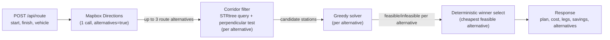

# TankWise Algorithm Design

This is a technical walkthrough of how TankWise turns a start/finish location into
the cheapest feasible fueling plan: the solver's greedy strategy and why it's
provably optimal, the corridor filter's projection math, the STRtree spatial
index and its real measured speedup, the route-alternatives strategy, and the
complexity of each stage. Every number below is either read directly out of the
solver/corridor source or reproduced from a real, reproducible local benchmark
run — nothing here is estimated or rounded for effect.

## Overview

The problem: given a start and finish location within the continental US, find a
valid driving route and the cheapest feasible sequence of fuel stops along it,
respecting a vehicle's tank range and fuel efficiency. The API's unchanged
default vehicle profile is **10 mpg / 500-mile tank range / a full starting
tank** (the frontend's Semi-loaded preset overrides this per-request via the
optional `vehicle` field, but the API contract's own default never changed).

The station dataset behind every candidate fuel stop is a fixed OPIS truck-stop
diesel price snapshot, geocoded offline in three stages:

- **8,151** raw CSV rows
- **6,738** resolved to coordinates by the one-time US Census Bulk Geocoder
  backfill (`geocode_stations`)
- **6,290** of those are *routable* stations the solver can actually use
  (526 rooftop-geocoded, 5,764 city-centroid) — the remaining 448 geocoded rows
  fail a sanity/bounds check and are excluded, never fed to the corridor filter
  or the solver

`Station.objects.routable()` is the single queryset both the corridor index and
this document draw the 6,290 figure from.

## Request Pipeline



Corridor + solver run once per route alternative Mapbox returns (typically 1-3),
never once per request — see "Route Alternatives" below.

## Corridor Filter: the equirectangular projection trick

A fuel stop only counts as "on the route" if it falls within a precision-tiered
perpendicular distance of the route polyline: `CORRIDOR_ROOFTOP_MI` (5 miles) for
a precisely-geocoded (rooftop) station, or `CORRIDOR_CITY_MI` (20 miles) for a
city-centroid one. Measuring that distance correctly requires solving a
projection problem first: shapely's `LineString.distance()`/`.project()` operate
in the coordinate units of the geometry you hand them, and 1° of longitude is
*not* the same real-world distance as 1° of latitude anywhere except the
equator.

`routing/services/corridor.py` fixes this with a manual equirectangular
projection rather than pulling in `pyproj`/GDAL: each point's longitude is
scaled by `cos(mean_latitude)` before both coordinates are scaled to miles by
`MI_PER_DEGREE_LAT` (69.172 mi/deg, i.e. ~111.32 km/deg converted to miles).
`build_planar_route()` projects the whole route once; `project_point()` projects
one candidate station into the identical planar frame, so the perpendicular
distance comparison between the two is apples to apples.

The one thing that has to be consistent across both calls is *which* mean
latitude they use — `mean_lat_rad()`'s own docstring calls this out explicitly:
computing it once per corridor pass and threading it through as a keyword
argument (rather than letting every call re-derive it from the same route
coordinates) is what the codebase calls "the hoisting fix," and it's the first
of the two real, measured speedups in the benchmark table below.

The corridor test itself is a *precise* perpendicular-distance check against
the actual route polyline — not an endpoint-to-endpoint or bounding-box
shortcut, both of which include or drop stations incorrectly depending on the
route's shape (a long looping route and a straight one with the same endpoints
have very different corridors).

## STRtree Spatial Index

Before Phase 7, every request issued a DB bounding-box query (`latitude__range`/
`longitude__range`) against the `Station` table to shrink the candidate set
before running the perpendicular test. That query is what the STRtree replaces:
a process-level [shapely `STRtree`](https://shapely.readthedocs.io/) built once,
lazily, from `Station.objects.routable()` (`corridor._build_index()` /
`_get_index()`, guarded by double-checked locking so concurrent first-request
builds under a threaded worker collapse into one build). After that first
build, the request path issues **zero** database queries for the corridor pass
— the route geometry is buffered by the wider of the two corridor axis pads (an
isotropic buffer is always over-inclusive along the narrower axis, never
under-inclusive, so the precise perpendicular test downstream still discards
the extras) and queried against the tree with `predicate="intersects"`.
`reset_index()` is the sole invalidation hook, called only from `seed_stations`
after a reseed commits — never from `candidates()` itself, which would defeat
the point of removing the per-request query.

### Measured before/after

These are locally reproducible numbers from a single development machine, not a
controlled or isolated benchmark environment — treat them as directionally
honest, not lab-grade precise. Measured on Windows 11, Python 3.12.10, against
the seeded dev SQLite database (6,290 routable stations), single process, no
other load. The STRtree figure is warm (excludes the one-time tree-build cost,
since production only pays that once per process). Median of 5 repeats per
variant per route, 2,000-point synthetic geometries:

| Route | Legacy bbox | + hoisted mean_lat | + STRtree (warm) | Hoist speedup | STRtree speedup |
|-------|-------------|---------------------|-------------------|----------------|-------------------|
| New York → Los Angeles | 199.28ms | 99.01ms | 19.22ms | 2.01x | 5.15x |
| Chicago → Houston | 101.22ms | 90.91ms | 26.28ms | 1.11x | 3.46x |
| Seattle → Miami | 625.45ms | 329.95ms | 22.28ms | 1.90x | 14.81x |
| **Median across routes** | **199.28ms** | **99.01ms** | **22.28ms** | **2.01x** | **4.44x** |

The Seattle → Miami route shows the largest STRtree win because its bounding
box spans nearly the full continental US diagonally — the legacy rectangular
bbox query pulls in a much larger candidate set than a route-shaped buffer does
for the same trip.

Anyone with the repo cloned and the dev database seeded can reproduce these
numbers with:

```bash
python manage.py benchmark_corridor --routes 3 --points 2000 --repeats 5
```

`benchmark_corridor` synthesizes offline routes between hardcoded continental-US
endpoint pairs (no Mapbox call), times the legacy DB-bbox path, the same path
plus the hoisting fix, and the current STRtree path, and asserts all three
return an identical candidate set before reporting timings — a faster path
that returns a different answer would be a bug, not a speedup, and the command
raises `CommandError` rather than reporting a misleading number. It is
deliberately excluded from CI (timing numbers are informational, not a
pass/fail gate).

## Solver Design: a greedy that's provably optimal

`routing/services/solver.py`'s `solve()` walks the route once, left to right,
maintaining current position, fuel on board, and the current (real-or-START)
node's price. At each step it looks at every candidate reachable from here
(bounded by the tank range from a real station, or by whatever fuel is
physically on board from the non-purchasable START node) and takes exactly one
of four branches, each recorded on the resulting `FuelStop` as a
`purchase_reason`:

- **`reach_cheaper_stop`** — a strictly cheaper station is reachable: buy just
  enough fuel here to reach it (never more), then jump there.
- **`reach_finish`** — no cheaper station is reachable, but the finish line is:
  buy just enough to finish (the "endpoint rule" — never top off the tank if
  there's nothing left to spend it on).
- **`fill_to_continue`** — no cheaper station or the finish is reachable from
  here, so fill the tank and jump to the cheapest reachable station (ties
  broken by nearest, never the farthest).
- **`top_up_at_cheapest`** — same fill-and-jump branch, but relabeled when the
  current price is already at or below every station still ahead, so the
  purchase isn't "reluctantly continuing" but genuinely topping off at the best
  price available for the rest of the trip.

**Why greedy is optimal here:** buying fuel that never gets burned strictly
increases cost, so an optimal purchase amount is always either exactly enough
to reach some specific later node, or a full tank — nothing in between is ever
worth paying for. Given that, the cheapest strategy is to always buy the
least fuel necessary to reach the next strictly cheaper price, and only commit
to a full tank (paying today's price for miles you might not need at the
cheapest rate) when nothing cheaper is reachable. Because the algorithm never
backtracks and only ever makes the locally-forced choice at each node, it runs
in a single left-to-right pass with no search.

This isn't just asserted — it's proven by a property test. `python manage.py
test` doesn't just check hand-picked edge cases; a dedicated Hypothesis test at
`routing/tests/test_solver_optimality.py` (`SolverOptimalityTests.
test_solver_matches_brute_force_optimum`) generates 200 randomized examples of
station price/position landscapes (up to 6 stations, random tank range, mpg,
starting fuel fraction, and total route length) and compares the greedy
solver's output against a deliberately dumb, independent exhaustive oracle — a
memoized recursive search over `(node, fuel-remaining)` states that enumerates
every station subset and purchase amount rather than reasoning about which ones
belong in an optimal plan. The oracle never imports or calls any solver helper
beyond the shared `Candidate` dataclass, so a passing test is real evidence
about the solver's behavior, not a shared-assumption tautology between two
implementations of the same idea. The test asserts feasibility agrees exactly
and total cost matches within `Decimal("0.0001")` — four orders of magnitude
tighter than a cent, loose enough only to absorb `Decimal` summation-order
rounding noise, never a real optimality gap.

Because the solver optimizes for total cost rather than stop count or distance,
the number of stops tracks the price landscape along a corridor, not trip
length: a 1,329-mile Dallas → DC route needs 10 stops while the longer
1,437-mile Dallas → Los Angeles route needs only 5, and both are correct
outputs for their respective price landscapes.

## Route Alternatives

`get_routes()` fetches every driving route alternative Mapbox offers between
two points in exactly one Mapbox Directions call (`alternatives=true`,
`geometries=geojson`, `annotations=duration,distance`) — never a second network
round trip to compare route options. `RouteView._solve_all_alternatives()` then
runs the full corridor-filter + solver pipeline once per alternative Mapbox
returned (its only sanctioned per-alternative `try`/`except`, narrowed to
`InfeasibleRouteError`, so one infeasible alternative doesn't abort the others
— and if every alternative turns out infeasible, the smallest-gap failure
across all of them is what's raised, reporting the closest miss rather than an
arbitrary one).

`_select_winner()` then picks the alternative to actually serve with a plain
`min(...)` over a four-level deterministic tuple key — no weighted scoring:

1. lowest `total_cost`
2. then lowest `total_route_mi` (tie-break)
3. then lowest `duration_s` (further tie-break; a missing duration sorts last
   via a `Decimal("Infinity")` sentinel, never preferred over a route that has
   a real one)
4. then Mapbox's own ordinal index (final deterministic tie-break)

The same request always resolves to the same winner. Every alternative
considered — chosen or not — is echoed back in the response's
`alternatives_considered` count and `alternatives[]` array (`total_route_mi`,
`duration_s`, `total_cost` or `null` if infeasible, `chosen`, `feasible`), so a
client can see what else was on the table, not just what won.

## Complexity

Let `n` = 6,290 (routable stations), `P` = route geometry points (Mapbox
returns a few hundred to a couple thousand for a cross-country trip; the
benchmark above uses 2,000 as a stress case), `k` = candidate stations
surviving the corridor buffer for one route (typically a small fraction of
`n` — a narrow rooftop/city corridor around a single route, not the whole
dataset), `m` = corridor candidates fed to the solver for one alternative
(== `k`), and `a` = the number of route alternatives Mapbox returned
(1-3 in practice).

**Corridor filter, per alternative:**
- Building the planar route once: `O(P)`.
- STRtree query (`predicate="intersects"` over a buffered route polygon):
  `O(log n + k)` — versus the legacy per-request DB bbox query it replaced,
  which is a linear index-range scan bounded by `O(n)` in the worst case
  (a corridor spanning most of the continental US, as the Seattle → Miami
  benchmark row demonstrates).
- The tree itself is built once per process, lazily, at `O(n log n)` — never
  repeated per request.
- The precise perpendicular-distance test on each STRtree survivor:
  `O(k · P)` (shapely's `LineString.distance()`/`.project()` scan the line's
  segments), since this exact test — not a shortcut — is what's applied to
  every candidate the tree query returns.

**Solver, per alternative:** sorting the `m` corridor candidates is
`O(m log m)`. The main loop's iteration count is bounded by the number of
stops in the resulting plan (at most `m + 1`), but each iteration rescans the
full `ordered` list to recompute the reachable/cheaper sets and the
skipped-station bookkeeping (`_skipped_context`, `_price_percentile`), so the
solver is `O(m²)` worst case — `m` being the corridor's candidate count, not
the full 6,290-station dataset, since the corridor filter has already narrowed
the search space by the time the solver runs.

**Route alternatives:** the whole corridor + solver pipeline runs once per
alternative, so total request cost scales as `a × (corridor + solver)` rather
than a single pass — still inside the "1 ideal, 2-3 acceptable" external-call
budget, since all `a` alternatives come back from the one Mapbox Directions
call.

## Worked Example: Dallas → Los Angeles

A 1,437-mile trip resolves to a 5-stop fueling plan (versus the shorter but
pricier-landscape 1,329-mile Dallas → DC trip, which needs 10 stops) —
illustrating that stop count tracks the price landscape along the corridor,
not raw trip length. Tracing the pipeline for this trip: Mapbox's one
Directions call returns the route geometry plus up to two alternatives; each
alternative's corridor pass buffers the route by the wider of the 5-mile
rooftop / 20-mile city corridor width, queries the STRtree for candidates
along that buffer, and runs the precise perpendicular test on the survivors;
the solver then walks those candidates left to right, buying just enough fuel
at each station to reach the next strictly-cheaper one (or filling up and
jumping to the cheapest reachable station when nothing cheaper is ahead) —
which is why this specific route settles on exactly 5 purchases rather than
the minimum number of stops physically required to cover 1,437 miles at a
500-mile range (which would be 2).
