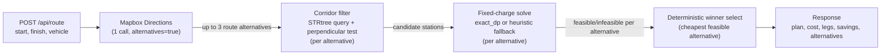

# TankWise Algorithm Design

This is a technical walkthrough of how TankWise turns a start/finish location into
the cheapest feasible fueling plan: the objective the solver minimises (fuel
dollars plus a flat per-stop charge), the fixed-charge dynamic program that
minimises it exactly, the domination prune that shrinks the DP's input before it
ever runs, the dispatch policy that decides when the exact program is even
attempted, and the penalty-aware fallback for when it is not — plus the corridor
filter's projection math, the STRtree spatial index and its real measured
speedup, the route-alternatives strategy, and the complexity of each stage.
Every number below is either read directly out of the solver/corridor source or
reproduced from a real, reproducible local benchmark run — nothing here is
estimated or rounded for effect.

## Overview

The problem: given a start and finish location within the continental US, find a
valid driving route and the fueling plan that minimizes fuel cost plus a flat
per-stop charge along it, respecting a vehicle's tank range and fuel efficiency.
The API's unchanged default vehicle profile is **10 mpg / 500-mile tank range /
a full starting tank** (the frontend's Semi-loaded preset overrides this
per-request via the optional `vehicle` field, but the API contract's own
default never changed).

The station dataset behind every candidate fuel stop is a fixed OPIS truck-stop
diesel price snapshot, geocoded offline in three stages:

- **8,151** raw CSV rows
- **6,738** resolved to coordinates by the one-time US Census Bulk Geocoder
  backfill (`geocode_stations`)
- **6,290** of those are *routable* stations the solver can actually use
  (526 rooftop-geocoded, 5,764 city-centroid) — the remaining 448 geocoded rows
  fail a sanity/bounds check and are excluded, never fed to the corridor filter
  or the solver

`Station.objects.routable()` is the single queryset both the corridor index and
this document draw the 6,290 figure from.

## Request Pipeline


```mermaid
flowchart LR
    Req["POST /api/route<br/>start, finish, vehicle"]
    Mapbox["Mapbox Directions<br/>(1 call, alternatives=true)"]
    Corridor["Corridor filter<br/>STRtree query + perpendicular test<br/>(per alternative)"]
    Solver["Fixed-charge solve<br/>exact_dp or heuristic fallback<br/>(per alternative)"]
    Winner["Deterministic winner select<br/>(cheapest feasible alternative)"]
    Resp["Response<br/>plan, cost, legs, savings, alternatives"]

    Req --> Mapbox
    Mapbox -- "up to 3 route alternatives" --> Corridor
    Corridor -- "candidate stations" --> Solver
    Solver -- "feasible/infeasible per alternative" --> Winner
    Winner --> Resp
```

Corridor + solver run once per route alternative Mapbox returns (typically 1-3),
never once per request — see "Route Alternatives" below.

## Corridor Filter: the equirectangular projection trick

A fuel stop only counts as "on the route" if it falls within a precision-tiered
perpendicular distance of the route polyline: `CORRIDOR_ROOFTOP_MI` (5 miles) for
a precisely-geocoded (rooftop) station, or `CORRIDOR_CITY_MI` (20 miles) for a
city-centroid one. Measuring that distance correctly requires solving a
projection problem first: shapely's `LineString.distance()`/`.project()` operate
in the coordinate units of the geometry you hand them, and 1° of longitude is
*not* the same real-world distance as 1° of latitude anywhere except the
equator.

`routing/services/corridor.py` fixes this with a manual equirectangular
projection rather than pulling in `pyproj`/GDAL: each point's longitude is
scaled by `cos(mean_latitude)` before both coordinates are scaled to miles by
`MI_PER_DEGREE_LAT` (69.172 mi/deg, i.e. ~111.32 km/deg converted to miles).
`build_planar_route()` projects the whole route once; `project_point()` projects
one candidate station into the identical planar frame, so the perpendicular
distance comparison between the two is apples to apples.

The one thing that has to be consistent across both calls is *which* mean
latitude they use — `mean_lat_rad()`'s own docstring calls this out explicitly:
computing it once per corridor pass and threading it through as a keyword
argument (rather than letting every call re-derive it from the same route
coordinates) is what the codebase calls "the hoisting fix," and it's the first
of the two real, measured speedups in the benchmark table below.

The corridor test itself is a *precise* perpendicular-distance check against
the actual route polyline — not an endpoint-to-endpoint or bounding-box
shortcut, both of which include or drop stations incorrectly depending on the
route's shape (a long looping route and a straight one with the same endpoints
have very different corridors).

## EIA Regional Price Indexing

The station dataset's prices are a frozen late-2024/early-2025 snapshot
(`Station.retail_price`), so every price the solver sees is scaled at
request time by a per-region factor before it ever reaches the corridor
candidate list: `factor = current-week EIA regional diesel average /
a committed baseline-week denominator`, where the denominator is the
same region's EIA value at the week nearest the snapshot's own vintage
(2025-01-01). Regions are sub-PADD (PADD 1A/1B/1C, 2, 3, 4, California
carved out of PADD 5, and the rest of PADD 5), since California's
diesel price runs well above the rest of the West Coast and a single
PADD-5 average would wash that out. A factor outside a 0.5-2.0x sanity
band is treated as corrupt data and discarded, falling back the same
way an unreachable EIA feed does.

The multiplier is applied at exactly one point, `routing/services/
corridor.py`'s `Candidate` construction, outside the pure solver --
`Station.retail_price` itself is never mutated, and because every
candidate in a given request is scaled by the same handful of regional
factors, the solver's price ordering (which station is cheaper than
which) is preserved exactly as if it were reading raw prices.

The current week's factor table is fetched from `api.eia.gov` at most
once, lazily, and cached in Redis for 24 hours (EIA publishes weekly)
using a two-key scheme: a TTL'd "current" entry and a persistent
last-known copy with no expiry. A request never blocks on a live EIA
call beyond the first one after the cache expires; if EIA is
unreachable, the last-known factors keep serving with an honest
"(latest available)" disclaimer, and if no factors have ever been
fetched (or `EIA_API_KEY` is unset), the app runs in a frozen-snapshot
mode -- factor 1.0, the original 2025-01-01 disclaimer -- rather than
ever erroring or silently overstating freshness.

## STRtree Spatial Index

Previously, every request issued a DB bounding-box query (`latitude__range`/
`longitude__range`) against the `Station` table to shrink the candidate set
before running the perpendicular test. That query is what the STRtree replaces:
a process-level [shapely `STRtree`](https://shapely.readthedocs.io/) built once,
lazily, from `Station.objects.routable()` (`corridor._build_index()` /
`_get_index()`, guarded by double-checked locking so concurrent first-request
builds under a threaded worker collapse into one build). After that first
build, the request path issues **zero** database queries for the corridor pass
— the route geometry is buffered by the wider of the two corridor axis pads (an
isotropic buffer is always over-inclusive along the narrower axis, never
under-inclusive, so the precise perpendicular test downstream still discards
the extras) and queried against the tree with `predicate="intersects"`.
`reset_index()` is the sole invalidation hook, called only from `seed_stations`
after a reseed commits — never from `candidates()` itself, which would defeat
the point of removing the per-request query.

### Measured before/after

These are locally reproducible numbers from a single development machine, not a
controlled or isolated benchmark environment — treat them as directionally
honest, not lab-grade precise. Measured on Windows 11, Python 3.12.10, against
the seeded dev SQLite database (6,290 routable stations), single process, no
other load. The STRtree figure is warm (excludes the one-time tree-build cost,
since production only pays that once per process). Median of 5 repeats per
variant per route, 2,000-point synthetic geometries:

| Route | Legacy bbox | + hoisted mean_lat | + STRtree (warm) | Hoist speedup | STRtree speedup |
|-------|-------------|---------------------|-------------------|----------------|-------------------|
| New York → Los Angeles | 199.28ms | 99.01ms | 19.22ms | 2.01x | 5.15x |
| Chicago → Houston | 101.22ms | 90.91ms | 26.28ms | 1.11x | 3.46x |
| Seattle → Miami | 625.45ms | 329.95ms | 22.28ms | 1.90x | 14.81x |
| **Median across routes** | **199.28ms** | **99.01ms** | **22.28ms** | **2.01x** | **4.44x** |

The Seattle → Miami route shows the largest STRtree win because its bounding
box spans nearly the full continental US diagonally — the legacy rectangular
bbox query pulls in a much larger candidate set than a route-shaped buffer does
for the same trip.

Anyone with the repo cloned and the dev database seeded can reproduce these
numbers with:

```bash
python manage.py benchmark_corridor --routes 3 --points 2000 --repeats 5
```

`benchmark_corridor` synthesizes offline routes between hardcoded continental-US
endpoint pairs (no Mapbox call), times the legacy DB-bbox path, the same path
plus the hoisting fix, and the current STRtree path, and asserts all three
return an identical candidate set before reporting timings — a faster path
that returns a different answer would be a bug, not a speedup, and the command
raises `CommandError` rather than reporting a misleading number. It is
deliberately excluded from CI (timing numbers are informational, not a
pass/fail gate).

## Solver Design: a fixed-charge dynamic program, dispatched behind a two-layer policy

The solver's job is not simply "cheapest fuel" — it is "cheapest fuel plus the
real dollar cost of making a stop at all." `routing/services/solver.py`'s
`solve()` is now an orchestration seam over the pieces below: it validates the
request, runs a price-independent feasibility check, prunes the search space,
picks which arm actually computes the plan, and rebuilds each stop's reporting
statistics over the full candidate list. It no longer runs a search itself.

### The objective

Every plan is scored on **fuel dollars plus a flat charge for each station
actually purchased at**, minimised jointly — not fuel dollars alone. The flat
charge is `FUEL_STOP_PENALTY_USD` (`config/settings/base.py`), shipped at a
default of **$35 per stop**. Its citation, carried verbatim from the setting's
own derivation comment: ATRI's "An Analysis of the Operational Costs of
Trucking" (2021 update) reports $66.87/hour all-in marginal operating cost;
TruckerPath inflation-adjusts that to $70/hour and applies an
independently-derived 30-minute average fuel-stop duration; 30 min × $70/hr =
$35/stop. (Re-deriving with ATRI's 2024 figure, $90.89/hr, at the same
30-minute assumption yields roughly $45 — $20–$45 is the defensible band, and
$20/$35/$45 were measured to select identical stop counts on all twelve
surveyed corridors, so the exact figure inside that band is a citation choice,
not a behavioral one.)

The charge is resolved once, at the Django settings layer, and passed into the
pure solver as a plain `penalty` keyword — never read from a live setting
inside `solver.py`/`dp.py`/`heuristic.py`/`prune.py` themselves, enforced by an
AST gate (`SolvePenaltyKwargGateTest`).

**`total_cost` — the field the API response actually reports — stays fuel
dollars only; the per-stop charge is never added to it.** The charge shapes
*which* plan gets chosen (a stop is only worth taking when the fuel it saves
beats the $35 it costs), but it is not part of the number a caller sees as the
trip's cost, so the response's savings figure stays a like-for-like comparison
against the price-blind baseline. A reader who does not know this can misread
a plan with a higher `total_cost` as a regression, when what actually happened
is the solver chose fewer, cheaper-overall stops and the charge that shaped
that choice simply never appears in the number being compared.

### The recurrence

`routing/services/dp.py`'s `solve_fixed_charge` is a dynamic program over
`(node, fuel)` state, where `node` ranges over START, every surviving
candidate (after the prune below), and FINISH, and `fuel` ranges over a
provably finite set of *useful* post-purchase levels at each node. The
**finite-fill lemma** (the module's own docstring, proven by a perturbation
argument) establishes that an optimal plan only ever leaves a station with one
of three fuel levels: whatever was already on board (buy nothing), the exact
amount needed to reach some specific later candidate or FINISH, or a full
tank — buying anything strictly between two of those wastes money on range the
plan never uses, and buying past "full" cannot physically fit in the tank.
Bounding the fuel dimension this way keeps the state count at `O(m²)` over `m`
post-prune candidates, and the enumeration itself is **total**: `solve_fixed_charge`
never raises for infeasibility (D-17), because `preflight_gap_check` — a
price-independent reachability check the caller always runs first, over the
*unpruned* candidate list — is itself the feasibility condition. If it passes,
stopping at every station in turn is already a feasible plan, so the
recurrence always has somewhere to relax to.

A Pareto state-dominance pass (`_pareto_frontier`) discards a state whenever
another state at the same node arrives with at least as much fuel via a
strictly better path, proven (by an exchange argument in the same module
docstring) never to remove the true optimum — and every relaxation and the
final winner selection resolve through one explicit, deterministic tie-break
key (position, then cost, then stop count, then station id), so the same input
always retraces the same relaxations and produces a byte-identical plan.

### The prune

Before the DP ever runs, `routing/services/prune.py`'s
`prune_dominated_candidates` removes stations a single earlier, cheaper-or-equal
station already makes redundant. The **supply-interval lemma** it is built on:
a station `S` at position `pos_S` can, by itself, ever supply fuel only to
route miles in `[pos_S, min(pos_S + tank_range_mi, total_route_mi)]`. Station
`A` is removable when some earlier station `B` (`price_B <= price_A`) either
sits at the identical position, or `B`'s own supply interval already reaches
FINISH — in either case `supply(B)` contains `supply(A)`, so anything `A` could
supply, `B` can supply at a price no higher. For the fixed-charge objective
specifically, folding `A`'s purchase into `B` costs `penalty + price_B * q <=
penalty + price_A * q` pointwise in `q`, at **zero extra stops** — a single
station absorbs `A`'s entire role. (This single-station argument does not
extend to two stations jointly covering `A`: splitting a purchase across `B1`
and `B2` pays the flat charge twice, which can outweigh an arbitrarily small
fuel saving — the rule only ever removes a station when one earlier station
alone can stand in for it.)

The prune's real measured reduction, from the widened 26-cell grid
(`19-MEASUREMENTS.md`, Measurement A): the densest corridor in the sweep by
raw candidate count is **`toronto_oh-hillsboro_or`, raw=509** (both tank
ranges — raw count depends only on corridor geometry, not tank range) — not
`dallas_tx-seattle_wa`, which this document's own worked example deliberately
avoids over-indexing on (see "Worked Example" below). At 1,050 miles, the
prune takes that 509 down to **kept=214** — a 58% reduction in what the DP has
to search — and at 500 miles down to **kept=245**.

### The dispatch policy, both layers

The DP's own optimizations (integer-tick arithmetic, Pareto pruning, an
exact-integer money-domain comparison) took the worst measured corridor from
~646s to ~46s and hit a structural wall: the remaining cost is the transition
*count*, not any one operation's per-call cost. Two layers decide when the
exact program is even attempted, and how long it is allowed to run once it is:

**Layer one — a pre-flight estimate against a budget.** `dp.estimate_transition_count`
is a cheap, deterministic, `O(n log n)` structural upper bound on the
recurrence's transition count, computed over the pruned search set. `solve()`
compares it against `dp.DP_TRANSITION_BUDGET`, shipped at **50,000**. At or
under budget, `solve()` attempts `dp.solve_fixed_charge`
(`strategy=SolverStrategy.EXACT_DP`); over budget, it dispatches straight to
the fallback described below without attempting the DP at all.

**Layer two — a wall-clock deadline, checked on a fixed stride.** An attempted
DP solve still runs under `dp.DP_DEADLINE_SECONDS`, shipped at **2.8 seconds**,
checked every `dp._DEADLINE_CHECK_STRIDE` = **5,000** transitions examined. If
the deadline fires before FINISH is reached, `solve_fixed_charge` raises
`dp.DeadlineExceededError` — a dedicated exception, never a bare timeout —
carrying the deadline, the elapsed time, and the transition count at the
moment of the raise. `solver.solve()` catches that exception itself; it never
crosses the solver's own boundary to a caller.

Both layers fall back to the identical target: `routing.services.heuristic.
solve_penalty_aware_heuristic` (`strategy=SolverStrategy.PENALTY_AWARE_HEURISTIC`).
Per its own module docstring, this is a single forward pass that approximates
the same fixed-charge objective the DP minimises exactly — at each station
with a strictly cheaper reachable option, it weighs the summed fuel-dollar
saving of detouring through the cheaper stations against the flat penalty, and
either fills up and bypasses them or buys just enough to reach the single
cheapest one — but it carries **no optimality proof**: it is a single pass
with no backtracking and no lookahead beyond one tank's own reach, and it can
produce a plan more expensive than the DP's exact answer. It never claims
optimality anywhere in its own output, docstrings, or the API's
`solver_strategy` field. It is a distinct algorithm from the retired
pre-Phase-18 greedy (`routing/services/greedy.py`), which is structurally
blind to the per-stop penalty — that module stays in the codebase only as a
differential-test subject (see "What the proof now covers" below) and is no
longer reachable from a live `solve()` call.

### Observability and cache coupling

A deadline breach is visible two ways, both deliberately without changing the
response contract: a `dp_deadline_breach` Server-Timing entry
(`routing/views.py`) records the elapsed milliseconds, and a structured log
line records the route-alternative index and the same figures — no request
body, address, or coordinates. No new response field was added for this,
because the demoted-vs-breached distinction is already derivable from the
`(estimate, strategy)` pair a caller can already recompute offline: an
estimate above budget with the heuristic strategy means demoted outright; an
estimate at or below budget with the heuristic strategy means attempted and
breached.

The route cache key (`routing/cache.py`, currently prefixed `route:v8:`)
carries a `d:` token derived directly from `dp.DP_TRANSITION_BUDGET` and
`dp.DP_DEADLINE_SECONDS` (`_dispatch_policy_token`). This means a plan computed
under one dispatch policy can never be served, unchanged, to a request the
current build's policy would have handled differently — a future change to
either constant changes every cache key automatically, with no separate
bump-on-change convention to remember.

### What the proof now covers

The exactness claim is real, but narrower than the one this document used to
make: `solve_fixed_charge` is optimal for the fixed-charge objective **within
the region where it actually runs** — the cells the dispatch policy admits to
the exact arm, and that finish before the deadline. A dedicated Hypothesis
property (`routing/tests/test_solver_fixed_charge_optimality.py`) proves this
against an independent, memoized `(node, fuel)` oracle, mirroring the same
independence discipline the pre-Phase-18 greedy's own optimality test used.
The retired greedy is referenced here in its one real remaining role: it is
the **frozen differential referee** `routing/tests/frozen_greedy.py` and
`routing/tests/test_greedy.py` check the DP's `penalty=0` behavior against —
not the production algorithm, and not consulted by a live request.

## Route Alternatives

`get_routes()` fetches every driving route alternative Mapbox offers between
two points in exactly one Mapbox Directions call (`alternatives=true`,
`geometries=geojson`, `annotations=duration,distance`) — never a second network
round trip to compare route options. `RouteView._solve_all_alternatives()` then
runs the full corridor-filter + solver pipeline once per alternative Mapbox
returned (its only sanctioned per-alternative `try`/`except`, narrowed to
`InfeasibleRouteError`, so one infeasible alternative doesn't abort the others
— and if every alternative turns out infeasible, the smallest-gap failure
across all of them is what's raised, reporting the closest miss rather than an
arbitrary one).

`_select_winner()` then picks the alternative to actually serve with a plain
`min(...)` over a four-level deterministic tuple key — no weighted scoring:

1. lowest `total_cost`
2. then lowest `total_route_mi` (tie-break)
3. then lowest `duration_s` (further tie-break; a missing duration sorts last
   via a `Decimal("Infinity")` sentinel, never preferred over a route that has
   a real one)
4. then Mapbox's own ordinal index (final deterministic tie-break)

The same request always resolves to the same winner. Every alternative
considered — chosen or not — is echoed back in the response's
`alternatives_considered` count and `alternatives[]` array (`total_route_mi`,
`duration_s`, `total_cost` or `null` if infeasible, `chosen`, `feasible`), so a
client can see what else was on the table, not just what won.

## Complexity

Let `n` = 6,290 (routable stations), `P` = route geometry points (Mapbox
returns a few hundred to a couple thousand for a cross-country trip; the
benchmark above uses 2,000 as a stress case), `k` = candidate stations
surviving the corridor buffer for one route (typically a small fraction of
`n` — a narrow rooftop/city corridor around a single route, not the whole
dataset), `m` = corridor candidates fed to the solver for one alternative
(== `k`), and `a` = the number of route alternatives Mapbox returned
(1-3 in practice).

**Corridor filter, per alternative:**
- Building the planar route once: `O(P)`.
- STRtree query (`predicate="intersects"` over a buffered route polygon):
  `O(log n + k)` — versus the legacy per-request DB bbox query it replaced,
  which is a linear index-range scan bounded by `O(n)` in the worst case
  (a corridor spanning most of the continental US, as the Seattle → Miami
  benchmark row demonstrates).
- The tree itself is built once per process, lazily, at `O(n log n)` — never
  repeated per request.
- The precise perpendicular-distance test on each STRtree survivor:
  `O(k · P)` (shapely's `LineString.distance()`/`.project()` scan the line's
  segments), since this exact test — not a shortcut — is what's applied to
  every candidate the tree query returns.

**Prune, per alternative:** `prune_dominated_candidates` (`routing/services/
prune.py`) is a single sort plus two linear passes over the `m` corridor
candidates, with no tuned constants — `O(m log m)`, dominated by the sort. It
runs before the solve and shrinks `m` down to the post-prune candidate count
this document calls `m'` below, which is what the solver stages actually pay
for.

**DP arm, per alternative (attempted only when dispatched to `exact_dp`):**
the finite-fill lemma bounds the fuel dimension at each node by the number of
post-prune candidates strictly ahead of it plus one, giving `O(m'²)` states
over `m'` post-prune candidates. The recurrence's real cost driver is the
**transition count** — states × reachable fuel levels × reachable targets —
not any single operation's per-call cost; `dp.estimate_transition_count` is
the same-order, `O(m' log m')` structural upper bound on that count the
dispatch pre-filter compares against `DP_TRANSITION_BUDGET` before ever
attempting the DP (see "The dispatch policy" above), so the quantity the
pre-filter estimates and the quantity that actually drives the DP's wall-clock
cost are the same one, not two different figures reasoned about separately.

**Heuristic fallback, per alternative (taken whenever the DP is not
attempted, or breaches its deadline):** a single forward pass over the sorted
candidate list using `bisect`-based window queries (`routing/services/
heuristic.py`'s own `_window` helper, the same `O(log n)` idiom `dp.py`'s
`_reachable_ticks` uses), staying bounded near-linear in candidate count —
`O(m' log m')`, dominated by the initial sort — with no backtracking and no
`(node, fuel)` state space to enumerate at all. This is precisely why it stays
well under the request's latency budget on the corridors the DP itself cannot
finish in time.

**Route alternatives:** every stage above — corridor filter, prune, and
whichever solver arm is dispatched — runs once per alternative, so total
request cost scales as `a × (corridor + prune + solve)` rather than a single
pass, still inside the "1 ideal, 2-3 acceptable" external-call budget, since
all `a` alternatives come back from the one Mapbox Directions call.

## Worked Example: LA → Denver → Chicago (multi-stop, exact arm)

The prior version of this document worked Dallas → Los Angeles. That corridor
was never part of the re-measurement this rewrite is built on
(`19-MEASUREMENTS.md`), so it is replaced here with a trip that is: the SPA's
own LA → Denver → Chicago multi-stop demo chip, at the hero preset (6.5 mpg,
1,050-mile tank, full starting tank, $35 penalty), chosen because it is one of
only two cells in the measured grid still resolving to the **exact** arm at
the shipped `DP_TRANSITION_BUDGET=50,000` with a fully-traced stop list on
record — and it is deliberately not `dallas_tx-seattle_wa`, this milestone's
own over-represented worked example and production-incident corridor, which
this document is specifically asked not to lean on again.

Tracing the pipeline end to end, every figure from `19-MEASUREMENTS.md`'s
Measurement A: Mapbox's one Directions call returns the multi-leg route
geometry; the corridor pass surfaces **raw=330** candidates along the
buffered corridor; `prune_dominated_candidates` reduces that to **kept=31**
before the solve ever runs; `dp.estimate_transition_count` over those 31
survivors comes out to **estimate=9,264** — comfortably under the 50,000
budget, so `solve()` dispatches to `dp.solve_fixed_charge`
(`strategy=exact_dp`), and the attempt finishes at **0.0536s**, well inside
the 2.8s deadline. The exact DP returns a **single-stop** plan, **total_cost=
$469.5132881854584610490122303**, one purchase: **`PWI #525`, 149.574159982624549553683412
gallons, `purchase_reason=reach_finish`**.

That single stop is itself the objective in action, not an artifact of the
retired branch logic: the DP searched all 31 surviving candidates across the
whole multi-leg route and, having weighed every reachable station's fuel-dollar
saving against the flat $35 charge for stopping there, found that no station
anywhere on the route offered a saving worth a second $35 stop — the
fixed-charge-minimising answer over this exact search set is to fill once, at
`PWI #525`, and finish. A pre-Phase-18, penalty-blind greedy walk would have
had no such bypass logic; it would have kept detouring to each successively-
cheaper station regardless of how little fuel that detour actually bought.

## Known limitations

This section states, with figures, what the shipped system does not do. It is
volunteered rather than left for a reviewer to find by diffing this document
against the code.

**1. The dispatch policy is not fully recovered.** At the shipped
`DP_TRANSITION_BUDGET=50,000`, **11 of the 26 measured cells (42.3%) dispatch
to the penalty-aware heuristic, spanning 8 corridors** (measured 2026-08-05,
`19-MEASUREMENTS.md`: `atlanta_ga-denver_co`, `dallas_tx-seattle_wa`,
`demo_la_ca-new_york_ny`, `el_paso_tx-portland_me`, `jacksonville_fl-bangor_me`,
`miami_fl-boston_ma`, `san_diego_ca-jacksonville_fl`,
`toronto_oh-hillsboro_or`). This supersedes, but does not reconcile away, an
earlier, narrower-grid figure on the same record: **10 of 24 cells (41.7%),
spanning 7 of 12 corridors** (dated 2026-08-04, before the grid widened to
include both demo chips). Both figures stay on the record side by side rather
than being collapsed into one number, because the widening is itself
informative — more measured cells surfaced more demotions, not fewer. What
falling back costs, concretely: `dallas_tx-seattle_wa` moved from the exact
DP's 2 stops / $498.04 to the shipped heuristic's 3 stops / $552.24 — **+$54.20,
+10.9%** — when the `DP_TRANSITION_BUDGET=134,000` hotfix precursor was
lowered to 50,000. Every demoted cell loses the optimality guarantee this
document proves for the exact arm. The heuristic's own approximation gap
against the DP was last quantified in Phase 18 (`18-04d-SUMMARY.md`,
2026-08-01, on the corridors where the DP itself was tractable at the time:
6.5% average / 12.5% max off the exact optimum) — that figure predates this
plan's own re-measurement, `19-MEASUREMENTS.md` does not re-verify it, and it
is stated here as a historical, dated figure rather than a re-confirmed one.

**2. The dispatch estimate does not predict runtime, and no single threshold
can fix it.** `dallas_tx-seattle_wa`@500mi — the one cell known to have
breached the deployed worker's timeout in production, live, pre-hotfix —
estimates **61,912**. `dallas_tx-seattle_wa`@1050mi — a cell that must stay
admitted to the exact arm, live, pre-hotfix — estimates **117,852**, a LARGER
number for the cell that runs FASTER. Because dispatch is a single scalar
threshold, no `DP_TRANSITION_BUDGET` value can demote the smaller-estimate
breaching cell while retaining the larger-estimate fine one: either both fall
on the same side of the line, or the line ends up backwards. This is an
impossibility proven over these two witnesses — a property of the estimator
itself — not a threshold search that came up empty.

**3. A higher dispatch budget was measured and deliberately not shipped
(U-01).** A budget rung of **130,000** was genuinely measured to qualify:
under it, `dallas_tx-seattle_wa`@1050mi (estimate 117,895) resolved to the
exact arm on every one of **3 repeats**, worst response **2.750s**, comfortably
inside the 2.8s deadline. It is not shipped. Wiring it in reaching that rung
also, unavoidably, admits `dallas_tx-seattle_wa`@500mi (estimate 61,944) — and
that specific cell is the one
`DispatchDemotionGuardTests.test_known_live_breaching_cell_does_not_reach_exact_dp`
(`routing/tests/test_solver_dispatch.py`) exists to keep off the exact arm
permanently, having reproduced HTTP 500 5/5 at 30.5-35.7s live pre-hotfix. It
also non-deterministically flips
`PlanObjectiveGuardTests.test_dallas_seattle_stop_count_within_criterion_1_range`
(`routing/tests/test_plan_objective.py`), whose pinned
`DALLAS_SEATTLE_STOP_RANGE=(3, 4)` its own module comment states plainly is
"NOT a bound to widen." Reconciling those two guards with the wider budget is
a bounded follow-up, not a rewrite, and a todo carries it forward. **This plan
does not ship the budget change** — `git diff --stat routing/services/dp.py`
against this plan's own commits is empty; this section documents the finding,
nothing more.

**4. The latency requirement is unmet, and raising the budget cannot close
it.** The stated ceiling is `LATENCY_CEILING_SECONDS=1.0s`. The worst measured
**live** exact-arm solver stage this milestone has recorded is **3.9156s**, on
`demo_la_ca-denver_co-chicago_il`@1050mi — roughly **3.9x** the ceiling. The
genuinely new part is structural, not just a bigger number: `DP_DEADLINE_SECONDS`
is set to 2.8s specifically so an attempted exact-DP solve is allowed to run
for nearly three seconds before falling back — which means any cell whose
admission to the exact arm was ever a close call is, by construction, a cell
that needed something close to that whole allowance, and a solve that takes
seconds is already well over a one-second ceiling before it even finishes.
Only cells that were never close to the boundary — comfortably admitted and
comfortably fast, like `sacramento_ca-salt_lake_city_ut` at estimate 120 and
a live solver stage of a few milliseconds — can ever satisfy this requirement.
Recovering more of the demoted grid therefore cannot close this specific gap;
a wider budget only creates more near-boundary cells, which is exactly the
shape that breaches the ceiling. Stated plainly about the ceiling's own
standing, too: it traces to PROJECT.md's informal "sub-second solve" claim,
not to any user-experience or infrastructure measurement — the closest thing
this repository has to a load-bearing latency budget without ever having been
derived from one — and this project has now declined to move it four times
(plans 18-06, 18-08, 18-14, 18.1-10).

**5. The micro-stop finding on the highest-traffic demo corridor (U-03).**
Live, the LA → NYC demo chip takes a small purchase late in the trip — a
sub-11-gallon buy at a station named `ACI TRUCK STOP`, `reason=reach_finish` —
that captures only a few dollars against the much larger $35 flat charge,
exactly the behavior the fixed-charge objective exists to remove; the same
cell replayed offline on the neutral price basis instead produces a clean
3-stop plan with no purchase under 16 gallons. Plan 19-04's probe reproduced
this discrepancy at **exactly** the confidence it earned: replaying the
identical cell against the committed per-state EIA price basis (`eia_fixture`,
mechanism B1) alone yields the live-observed 4-stop pattern — `ACI TRUCK STOP`,
10.339 gallons, `reason=reach_finish`, matching to three decimal places on
gallons and exactly on station name and purchase reason — while a uniform
multiplier applied to the neutral basis (mechanism B2, tested across four
rungs from 0.8x to 1.5x) reproduces it at none of them; the station set and
stop count never move under B2. **This confirms the per-state EIA price basis,
not a uniform price level, as the cause** — the fixed-charge objective's own
bypass-vs-detour decision is sensitive to *relative* price differences
between stations, which per-state indexing genuinely changes and a uniform
scalar cannot. It is documented here, not fixed: the cure is a change to
`heuristic.py`'s bypass decision, out of this phase's scope.

**6. The fallback arm carries no optimality proof.** Per
`routing/services/heuristic.py`'s own module docstring, the penalty-aware
heuristic guarantees **feasibility** (every intermediate fuel level stays
within `[0, tank_range_mi]`) and **determinism**, but explicitly does NOT
guarantee fixed-charge optimality (it is a single forward pass with no
backtracking and no lookahead beyond one tank's own reach, and can produce a
strictly more expensive plan than the DP's exact answer) or minimal stop
count, and it never claims optimality anywhere in its own output, docstrings,
or the API's `solver_strategy` field.

**7. An intermittent, unidentified full-suite failure.** Roughly one run in
forty (~2.5%) has failed with no failing test name, traceback, or seed ever
captured — it has not reproduced in any of the 39 subsequent runs anyone has
actually examined, including two clean runs taken specifically to try. It is
tracked as a todo rather than hidden, and stays open until it either
reproduces with enough information to diagnose it or a much longer clean
streak makes it safe to consider resolved.

**8. The penalty-aware heuristic's trust margin covers one comparison, not
all of them (PROV-03, D-04).** Since Phase 21, both solver arms charge a flat
per-purchase margin for an `eia_regional_estimate`-priced station before
selecting it, but the two arms are not equally thorough. The exact DP applies
the margin to **every** purchase transition in its objective — the fixed-charge
integer key it searches already accounts for it at every station. The
penalty-aware heuristic (`routing/services/heuristic.py`) enters the margin
into exactly **one** comparison: the bypass test, `penalty + current_margin >
saving_total`, which decides whether a full-tank fill is worth flying past
one or more strictly-cheaper reachable stations. That is the only comparison
in this arm that was already fixed-charge-aware (it already sums a
per-station dollar saving against the flat penalty); every other price
comparison in the module — the cheapest-in-window `min()`, `_farthest`'s
tiebreak, and the direct `c.price_per_gallon < price_here` test — is a raw
per-gallon quantity with no purchase amount attached, so a flat charge has no
defined meaning there, and **none is synthesized** (D-05): a per-gallon
equivalent was considered and rejected because the two arms would then mean
different things by "trust margin," and the per-gallon form is unprovable
against the oracle's flat one.

The honest consequence, stated plainly in the module's own docstring: this
arm will still **hop toward** a cheap `eia_regional_estimate`-priced station
without paying its margin whenever the bypass test itself is never reached —
i.e., whenever there is no strictly-cheaper station in the current window to
trigger the comparison at all. This is a documented limitation of this
proof-free arm, not a defect being hidden.

Why it matters, cross-referenced rather than restated: limitation 1 above
already documents the current share of measured cells that dispatch to this
heuristic at the shipped `DP_TRANSITION_BUDGET=50,000` — including
`demo_la_ca-new_york_ny`, the LA → NYC demo chip, the app's highest-traffic
corridor, among the cells it names. Denser candidate sets push more cells
toward this arm (limitation 3 above), so the arm most likely to actually
meet real `eia_regional_estimate` rows once Phase 22 imports them is
precisely the one with only partial margin coverage.

**9. `prune.py`'s domination test retains a strict superset on
mixed-provenance data, and can never retain fewer (PROV-03, D-01).** Since
Phase 21, the domination test that shrinks the candidate set before either
solver arm searches it gained a third admission condition, alongside the
existing price and geometric ones: `margin_B <= margin_A`. Because the margin
is binary (a station either is or is not `eia_regional_estimate`-priced),
the new predicate reduces to one sentence, stated in the module's own
docstring: **an estimate-priced station may not dominate a real-priced one.**
Real-dominates-anything and estimate-dominates-estimate are unchanged.

No finite bound on the margin's dollar value restores the old price-only
condition — because the margin is a *fixed* charge while price is
*per-gallon*, at a small enough purchase quantity the margin term always
dominates the comparison, so this cannot be dissolved by choosing a small
margin. The rule is therefore **strictly weaker** than the margin-free rule:
it retains a superset of what the margin-free rule would retain, never
fewer, so `estimate_transition_count` — the signal the dispatch policy reads
— can only move **upward**. That is the conservative direction for
correctness (nothing that should survive is pruned away) and the unhelpful
direction for dispatch (more candidates pushes more cells toward limitation
1's heuristic-demotion figure and toward limitation 3's budget ceiling).

The inertness half of this claim is proven, not asserted: at zero
`eia_regional_estimate` rows, every candidate's margin is equal (`0`), so
condition 3 is vacuously satisfied for every pair and the retained set is
**provably identical** to what the margin-free rule retained. Plan 21-10's
closing 26-cell `measure_dispatch_grid` diff against the pre-change baseline
(`.planning/phases/21-provenance-trust-margin/`, 2026-08-07) came back
byte-empty on every deterministic field, confirming this in the actual
dispatch pipeline, not just the domination test in isolation. Measured
separately on a mixed-provenance corpus (`PRUNE_MIXED_CORPUS_PARAMS`,
25% tagged, plan 21-05, 2026-08-07): the margin-aware rule retains 264/500
candidates against 259/500 for the same corpus with every provenance forced
to `opis_indexed` — 5 more, confirming the strict-superset direction on real
(if synthetically tagged) data, not just by proof.

This also settles `.planning/research/ARCHITECTURE.md`'s Question 2 versus
Question 5 contradiction, dated 2026-08-07: Question 5's claim that the
margin can shift what `prune.py` keeps is correct, and Question 2's claim
that `estimate_transition_count` is untouched is superseded — both amended
in place on the research document itself, per this project's standing
amend-in-place convention.
